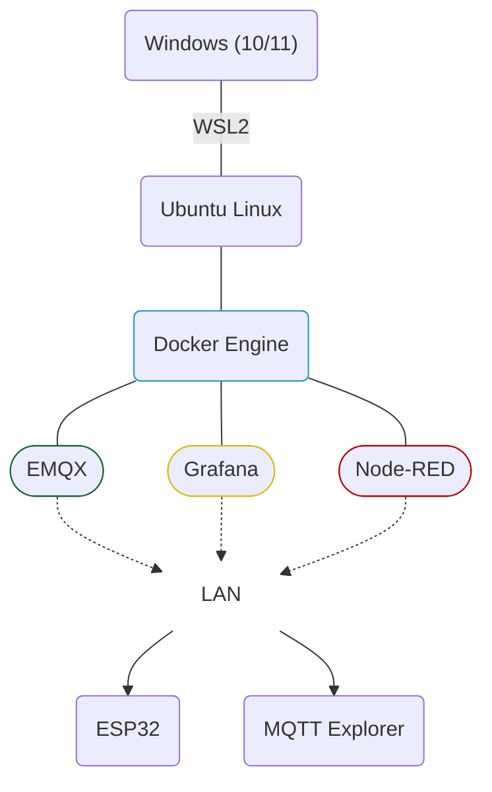
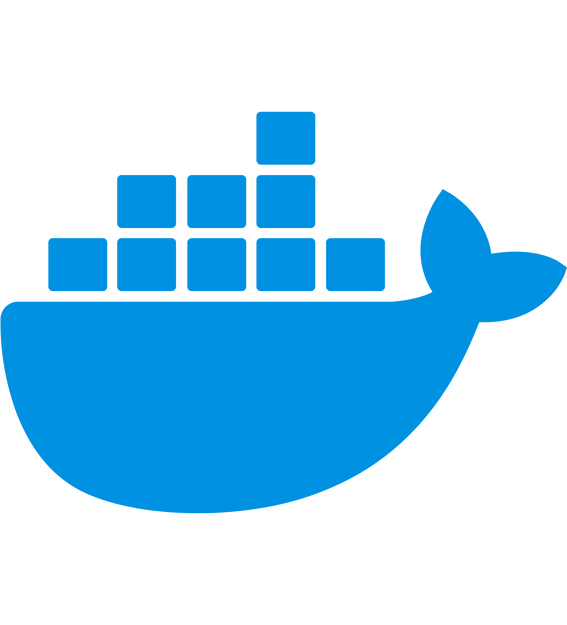
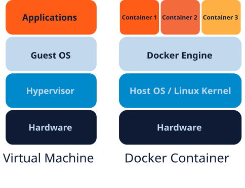
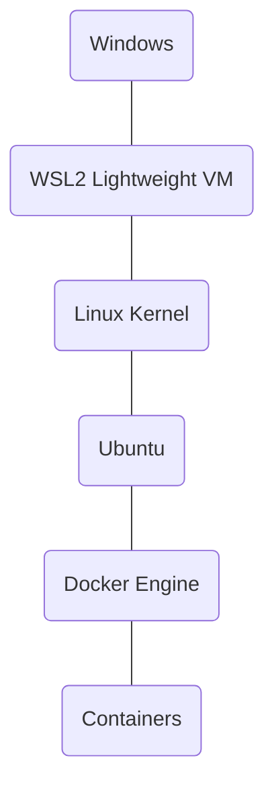
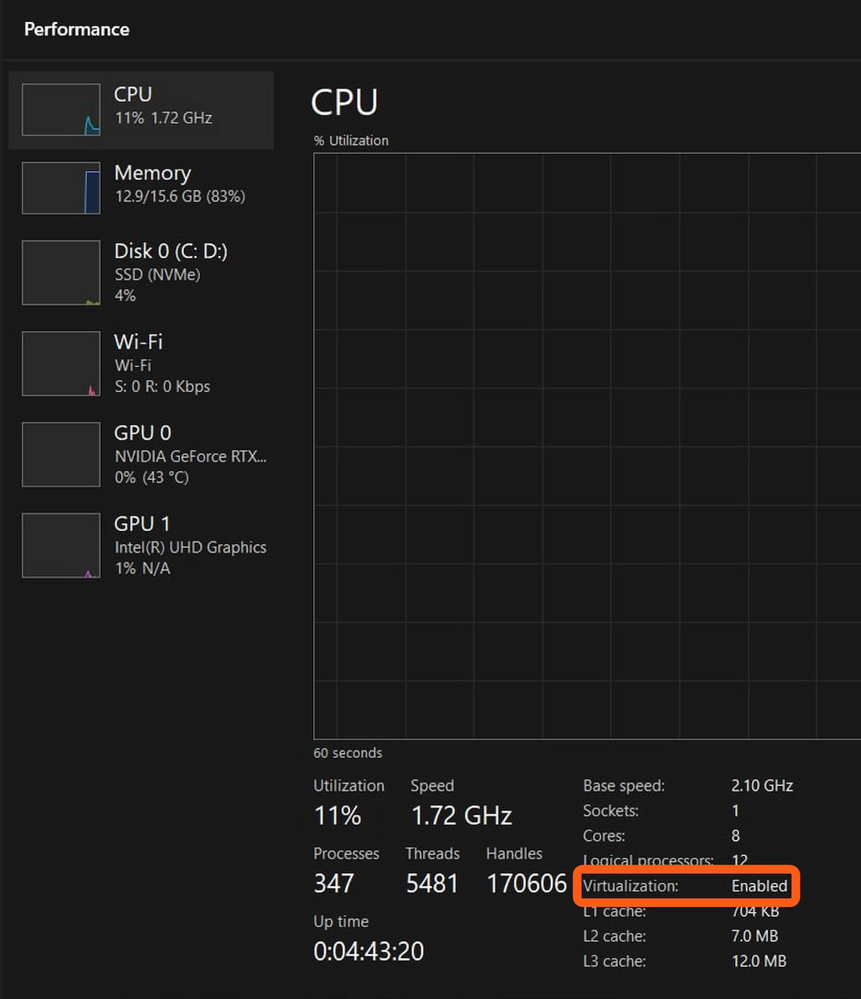
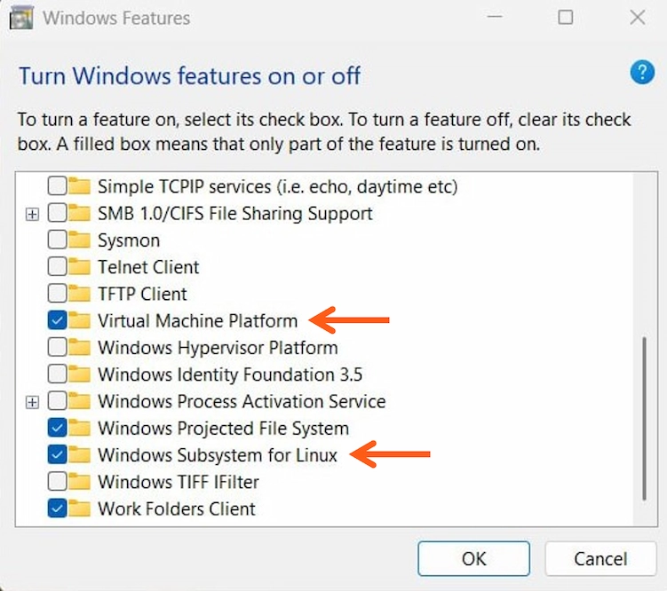
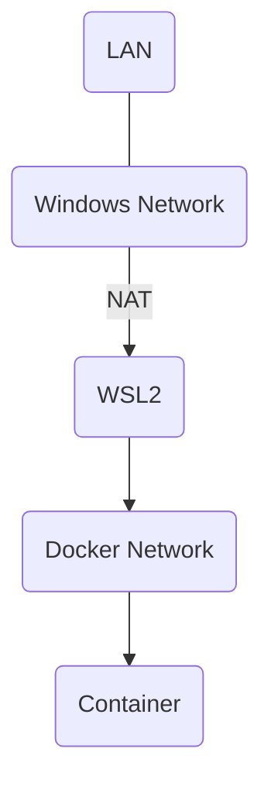
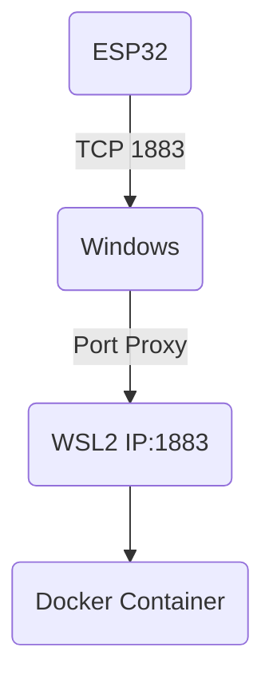
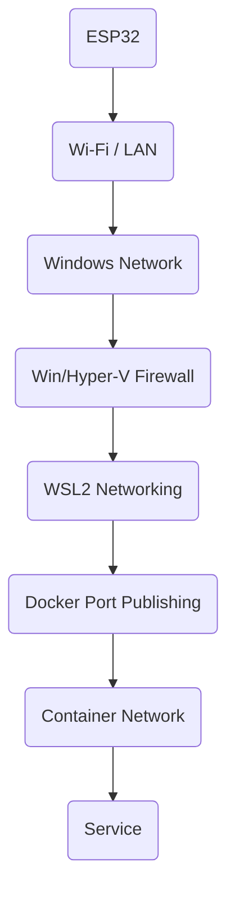

<p align="center">

  <picture>
    <source media="(prefers-color-scheme: dark)" srcset="../assets/EduminD_dark.webp">
    <source media="(prefers-color-scheme: light)" srcset="../assets/EduminD.webp">
    
  </picture>

</p>

<div align="center">
  <a href="https://t.me/X_MindWorld" target="_blank">
    
  </a>
  <a href="https://instagram.com/x_mindworld" target="_blank">
    
  </a>
  <a href="mailto:education.xmindworld@gmail.com" target="_blank">
    
  </a>
</div>


# راهنمای جامع زیرساخت آزمایشگاه خانگی: Docker، WSL2 و شبکه برای مهندسان IoT و اتوماسیون

> **زمینه:** Docker, Linux, WSL2, Embedded Systems, IoT Infrastructure & Networking  
> **سطح:** مقدماتی تا متوسط، با نکات عملی برای کاربران حرفه‌ای

---

# 📌 ۱. مقدمه و مسئله اصلی

برای توسعه و تست پروژه‌های IoT و اتوماسیون، معمولاً به چند سرویس مختلف نیاز داریم؛ مثل:

- MQTT Broker مانند EMQX یا Mosquitto
- Node-RED
- InfluxDB
- Grafana
- Nginx یا Reverse Proxy
- ابزارهای مانیتورینگ و تست

نصب مستقیم همه این سرویس‌ها روی سیستم‌عامل اصلی می‌تونه باعث افزایش وابستگی‌ها، سختی مدیریت نسخه‌ها و پیچیده‌شدن حذف یا جابه‌جایی سرویس‌ها بشه.

از طرف دیگه، استفاده از یک سرور ابری برای هر مرحله از توسعه و آزمایش همیشه ضروری یا اقتصادی نیست.

تو این راهنما یک آزمایشگاه خانگی مبتنی بر:

**Windows + WSL2 + Ubuntu + Docker Engine + Docker Compose**

راه‌اندازی می‌کنیم.

هدف اینه که یک محیط توسعه و آزمایش نزدیک به تجربه کار با Linux Server داشته باشیم. (WSL2 کاملاً معادل یک سرور Linux Bare Metal نیست.)

> [!IMPORTANT NOTE] **نکته مهم:**
>  WSL2 خودش یک محیط Linux مجازی‌شده‌ست. بنابراین رفتار شبکه، storage، lifecycle سیستم و دسترسی به سخت‌افزار می‌تونه با یک سرور Linux واقعی تفاوت داشته باشه.

---

# 🏗️ ۲. ساختار کلی آزمایشگاه خانگی

ساختار پیشنهادی:



در یک پروژه واقعی می‌شه سایر سرویس‌ها مثل InfluxDB، PostgreSQL، Nginx Proxy Manager یا Adminer رو هم به این معماری اضافه کرد.

---

#  ۳. Docker چیه و چرا برای آزمایشگاه خانگی مناسبه؟


<html>
  <div align = "center">
    
    <p> </p>
  </div>
</html>

داکر (Docker) یک پلتفرم برای بسته‌بندی و اجرای نرم‌افزارها در محیط‌هایی به اسم **Container** هست.

کانتیر(Container)ها فرآیندها و منابع موردنیاز یک سرویس رو از سایر سرویس‌ها جدا می‌کنن و باعث می‌شن استقرار و مدیریت نرم‌افزارها تکرارپذیرتر بشه.

## ۳.۱. قابلیت Isolation به معنی حذف کامل اثر روی سیستم نیست

اگه یک Container رو حذف کنید:
```bash
docker rm <container>
```

فایل‌سیستم writable همون Container از بین می‌ره؛ اما این به معنی حذف خودکار همه داده‌های مرتبط با سرویس نیست.

برای داده‌های دائمی معمولاً از:

- Docker Volume
- Bind Mount
استفاده می‌شه.

مثلاً:
```yaml
services:
  database:
    image: postgres
    volumes:
      - postgres_data:/var/lib/postgresql/data

volumes:
  postgres_data:
```

در این حالت داده‌ها در Volume نگهداری می‌شن و حذف Container به‌تنهایی Volume رو حذف نمی‌کنه.

> [!WARNING] **هشدار:** 
> حذف Volume می‌تونه باعث از دست رفتن داده بشه. Volume رو بخشی از استراتژی Backup در نظر بگیرین، نه جایگزین Backup.


## ۳.۲. مدیریت سرویس‌ها با Docker Compose

در یک آزمایشگاه خانگی معمولاً با چند سرویس مرتبط سروکار داریم.

برای مثال:
```text
EMQX
Node-RED
InfluxDB
Grafana
```

با Docker Compose امکان تعریف این سرویس‌ها، شبکه‌ها، Volumeها و تنظیماتشون در یک فایل Compose فراهم می‌شه.

در نسخه‌های جدید Docker، دستور استاندارد:
```bash
docker compose
```

هست.

مثال:
```bash
docker compose up -d
```

و برای متوقف‌کردن stack:
```bash
docker compose down
```

>[!NOTE]  **نکته:** 
>دستور قدیمی `docker-compose` یک مدل standalone قدیمی‌تره. در این راهنما از Compose Plugin و دستور `docker compose` استفاده می‌کنیم.

---

## ۳.۳. قابلیت Portability؛ قابل‌انتقال بودن، نه «اجرای بدون تغییر در همه‌جا»

یکی از مزایای Docker اینه که Dockerfile و پیکربندی Compose رو می‌شه در محیط‌های مختلف مجدداً استفاده کرد.

اما مواردی مثل:

- معماری CPU؛ مثلاً `amd64` در برابر `arm64`
- دسترسی به سخت‌افزار
- تنظیمات شبکه
- Storage
- Environment Variables
- Secrets
- وابستگی‌های خارجی
- نسخه Kernel

می‌تونن روی فرایند توسعه تأثیر بذارن.

🚩 بنابراین بهتره Docker رو ابزاری برای **قابل‌تکرار و قابل‌انتقال‌تر کردن deployment** بدونیم، نه تضمینی برای اجرای بدون تغییر در هر محیطی.

---

# ⚡ ۴. Docker Container در برابر Virtual Machine

دو فناوری Docker Container و Virtual Machine یکسان نیستن.

در یک VM معمولاً یک Guest OS کامل در کنار Hypervisor اجرا می‌شه.

در Containerها، فرآیندهای کانتینری در محیطی ایزوله اجرا می‌شن و در Linux معمولاً از قابلیت‌های Kernel مانند:
- Namespaces
- cgroups
برای جداسازی و مدیریت منابع استفاده می‌شه.

به‌ بیان ساده:


<html>
<div align = "center">
  <p> </p>
<picture>
  <source media="(prefers-color-scheme: dark)" srcset="./assets/Docker_Container_vs_VM_dark.svg">
  <source media="(prefers-color-scheme: light)" srcset="./assets/Docker_Container_vs_VM_light.svg">
  
</picture>
  <p> </p>
</div>
</html>

یک Container معمولاً Overhead کمتری نسبت به اجرای چند Guest OS کامل داره؛ اما این به معنی «بدون مصرف منابع» یا «بدون ایزوله‌سازی امنیتی» نیست.

---

# 🐧 ۵. WSL2 چیه؟


<html>
  <div align = "center">
    
    <p> </p>
  </div>
</html>

زیرسیستم **WSL2 یا Windows Subsystem for Linux 2** محیطی برای اجرای Linux روی Windows هست. و از یک Linux Kernel واقعی استفاده می‌کنه که در یک VM سبک اجرا می‌شه.

بنابراین:


این معماری یکی از دلایلیه که Docker Engine روی Ubuntu داخل WSL2 می‌تونه تجربه‌ای نزدیک به کار با Docker Engine روی Linux ارائه کنه.

اما:
>🚩 **نباید WSL2 رو با Linux Bare Metal یا یک VPS واقعی یکسان دونست.**

---

#  ۶. استفاده از Docker Desktop یا Docker Engine روی WSL2؟

هر دو انتخاب می‌تونن منطقی باشن.

| نیاز                                      | انتخاب مناسب‌تر        |
| ----------------------------------------- | ---------------------- |
| نصب و مدیریت ساده                         | Docker Desktop         |
| رابط گرافیکی و integration با Windows     | Docker Desktop         |
| یادگیری Linux و Docker Server             | Docker Engine روی WSL2 |
| تجربه نزدیک‌تر به Docker روی Linux Server | Docker Engine روی WSL2 |
| آزمایشگاه خانگی آموزشی Linux-oriented     | Docker Engine روی WSL2 |
| مدیریت ساده‌تر برای کاربر مبتدی           | Docker Desktop         |

نرم‌افزار Docker Desktop خودش می‌تونه از WSL2 backend استفاده کنه.

>[!IMPORTANT]
>در این راهنما **Docker Engine** رو انتخاب می‌کنیم چون هدف آموزشی ما آشنایی مستقیم‌تر با محیط Linux، Docker daemon، systemd و مفاهیم شبکه هست.

---

# ۷. پیش‌نیازهای ویندوز و WSL2

## ۷.۱. بررسی نسخه Windows

برای نصب WSL با روش‌های جدید، Windows 10 نسخه 2004 یا بالاتر و Windows 11 پشتیبانی می‌شن.

برای مشاهده نسخه Windows:
```powershell
winver
```

همچنین Virtualization سخت‌افزاری باید در سیستم فعال باشه.
برای بررسی این مورد می‌تونید از بخش CPU در تب Performance موجود در Task Manager استفاده کنید.

`Win + X -> Task Manager > Performance > CPU `

<html>
  <div align = "center">
    
    <p> </p>
  </div>
</html>

در صورت فعال نیودن Virtualization، در تنظیمات BIOS سیستمتون می‌تونید فعالش کنین. و درنهایت بعد از راه‌اندازی مجدد سیستم، در  `Turn Windows Features On or Off` بررسی کنین که تیک دو مورد زیر خورده باشن:

✔ Virtual Machine Platform

✔ Windows Subsystem for Linux


<html>
  <div align = "center">
    
    <p> </p>
  </div>
</html>

---

## ۷.۲. نصب WSL


ترمینال ویندوز (Terminal) یا PowerShell رو با دسترسی Administrator باز کنین:
```powershell
wsl --install
```

❗ ویندوز بعد از دانلود و نصب فایل اصلی WSL2، یک نسخه LTS از Ubuntu رو به شکل خودکار نصب می‌کنه.(اگه نصب نشد، بخش بعد رو بررسی کنید.)

بعد از نصب، در صورت درخواست، ویندوز رو Restart کنین.

 بعد از اون، وضعیت WSL رو بررسی کنین:
```powershell
wsl --status
```

و توزیع‌های نصب‌شده را ببینین:
```powershell
wsl -l -v
```

باید Distribution شما در ستون VERSION مقدار `2` داشته باشن.

مثلاً:
```text
NAME      STATE      VERSION
Ubuntu    Running    2
```

---

## ۷.۳. اگه Ubuntu نصب نشده بود

قبل از هرچیز توزیع‌های قابل نصب رو ببینین:
```powershell
wsl --list --online
```

بعد برای مثال Ubuntu رو نصب کنین: (اگه اولین تجربه‌تون برای کار با لینوکسه، Ubuntu رو پیشنهاد می‌کنیم.)
```powershell
wsl --install -d Ubuntu
```

پس از نصب، Ubuntu رو اجرا کنین و Username و Password لینوکس رو بسازین.

---

## ۷.۴. بررسی نسخه WSL

در Terminal:
```powershell
wsl --version
```

در صورت قدیمی بودن نسخه WSL:
```powershell
wsl --update
```

سپس دوباره:
```powershell
wsl --version
```

رو بررسی کنین.

---

# 🔧 ۸. فعال‌سازی و بررسی systemd

نسخه‌های جدید Ubuntu نصب‌شده از مسیرهای جدید WSL ممکنه systemd رو به‌صورت پیش‌فرض فعال داشته باشن.

اول بررسی کنین:
```bash
ps -p 1 -o comm=
```

اگه خروجی `systemd` بود، نیازی به فعال‌سازی دستی نیست.

در صورت نیاز، داخل Ubuntu فایل زیر رو باز کنین:
```bash
sudo nano /etc/wsl.conf
```

و این مورد رو اضافه کنین:
```ini
[boot]
systemd=true
```

بعد در Terminal:
```powershell
wsl --shutdown
```

و Ubuntu رو دوباره اجرا کنین و مورد زیر رو بررسی کنین:
```bash
systemctl list-unit-files --type=service
```

یا:
```bash
systemctl is-system-running
```

> [!NOTE] **نکته:** 
> فعال‌کردن systemd برای این راهنما مفیده چون مدیریت Docker daemon رو با ابزارهای استاندارد Linux ساده‌تر می‌کنه.

---

#  ۹. نصب Docker Engine روی Ubuntu

## ۹.۱. بررسی نسخه Ubuntu

داخل Ubuntu:
```bash
cat /etc/os-release
```

برای این راهنما بهتره از نسخه‌های LTS پشتیبانی‌شده Ubuntu استفاده کنین.

---

## ۹.۲. حذف پکیج‌های متعارض احتمالی

اگه قبلاً Docker رو از repository خود Ubuntu نصب کرده‌ باشین، ممکنه پکیج‌هایی مثل `docker.io` یا نسخه‌های قدیمی Compose با پکیج‌های رسمی Docker تداخل داشته باشن.

برای حذف پکیج‌های احتمالی:
```bash
sudo apt remove docker.io docker-compose docker-compose-v2 docker-doc docker-buildx podman-docker containerd runc
```

اگه هیچ‌کدوم نصب نباشن، مشکلی وجود نداره.

---

## ۹.۳. اضافه‌کردن Repository رسمی Docker

اول:
```bash
sudo apt update
sudo apt install ca-certificates curl
```

دوم:
```bash
sudo install -m 0755 -d /etc/apt/keyrings
```

کلید رسمی Docker رو دریافت کنین:
```bash
sudo curl -fsSL https://download.docker.com/linux/ubuntu/gpg \
  -o /etc/apt/keyrings/docker.asc
```

دسترسی خوندن کلید:
```bash
sudo chmod a+r /etc/apt/keyrings/docker.asc
```

مخزن رسمی Docker رو اضافه کنین:
```bash
sudo tee /etc/apt/sources.list.d/docker.sources <<EOF
Types: deb
URIs: https://download.docker.com/linux/ubuntu
Suites: $(. /etc/os-release && echo "${UBUNTU_CODENAME:-$VERSION_CODENAME}")
Components: stable
Architectures: $(dpkg --print-architecture)
Signed-By: /etc/apt/keyrings/docker.asc
EOF
```

سپس:
```bash
sudo apt update
```

---

## ۹.۴. نصب Docker Engine و Compose

```bash
sudo apt install docker-ce docker-ce-cli containerd.io docker-buildx-plugin docker-compose-plugin
```

---

## ۹.۵. بررسی Docker daemon

```bash
sudo systemctl status docker
```

اگه Docker در حال اجرا نبود:
```bash
sudo systemctl start docker
```

---

## ۹.۶. تست Docker

```bash
sudo docker run hello-world
```

اگه پیام موفقیت‌آمیز نمایش داده شد، Docker Engine درست نصب شده.

---

#  ۱۰. اجرای Docker بدون sudo

به‌صورت پیش‌فرض Docker daemon برای کاربر root در دسترسه.

برای اینکه کاربر فعلی بتونه بدون `sudo` از Docker CLI استفاده کنه:
```bash
sudo usermod -aG docker $USER
```

بعد Ubuntu را ببندید و دوباره باز کنین.

یا از Terminal یا PowerShell:
```powershell
wsl --shutdown
```

و دوباره Ubuntu رو اجرا کنین.

بعد:
```bash
docker run hello-world
```

> [!IMPORTANT] **نکته امنیتی مهم:**
>  عضویت در گروه `docker` عملاً دسترسی بسیار بالایی به Docker daemon می‌ده و نباید اون رو یک دسترسی معمولی و کم‌خطر در نظر گرفت.

---

# ۱۱. بررسی Docker Compose

نسخه Compose رو بررسی کنید:
```bash
docker compose version
```

اگه نسخه نمایش داده شد، Compose Plugin درست نصب شده.

یک پروژه آزمایشی ساده:
```bash
mkdir ~/docker-test
cd ~/docker-test
```

یک فایل `compose.yaml` ایجاد کنید:
```yaml
services:
  nginx:
    image: nginx:alpine
    ports:
      - "8080:80"
```

مرحله بعد:
```bash
docker compose up -d
```

بررسی:
```bash
docker compose ps
```

و:
```bash
curl http://localhost:8080
```

در پایان:
```bash
docker compose down
```

---

# 🌐 ۱۲. معماری شبکه WSL2

در حالت معمول، WSL2 از معماری شبکه مبتنی بر NAT استفاده می‌کنه.

به‌صورت مفهومی:



این ساختار باعث می‌شه دسترسی از یک دستگاه دیگه در LAN به سرویس داخل WSL همیشه به سادگی دسترسی ویندوز به `localhost` نباشه.

مایکروسافت روش‌های مختلفی برای دسترسی شبکه برای WSL2 ارائه می‌کنه.

در اینجا دو روش رو بررسی می‌کنیم:

1. **Mirrored Networking**
2. **Port Forwarding / Port Proxy**

---

#  ۱۳. روش پیشنهادی: Mirrored Networking

در Windows 11 نسخه 22H2 و بالاتر، WSL2 از حالت **Mirrored Networking** پشتیبانی می‌کنه.

این حالت، معماری شبکه WSL رو تغییر می‌ده و رابط‌های شبکه وینذوز رو در محیط لینوکس mirror می‌کنه.

✅ مزایا:
- دسترسی مستقیم‌تر WSL از LAN
- پشتیبانی بهتر از IPv6
- سازگاری بهتر با VPNها
- پشتیبانی از Multicast
- ارتباط بهتر با localhost

---

## ۱۳.۱. فعال‌سازی Mirrored Mode

فایل:
```text
%USERPROFILE%\.wslconfig
```

رو ایجاد یا ویرایش کنین.

محتوا:
```ini
[wsl2]
networkingMode=mirrored
```

بعد در PowerShell:
```powershell
wsl --shutdown
```

و Ubuntu رو دوباره اجرا کنین.
```PowerShell
wsl
```
---

# ⚠️ ۱۴. نقش Firewall در Mirrored Networking

فعال‌کردن Mirrored Networking به معنی بازشدن خودکار همه پورت‌ها در شبکه نیست.

ویندوز یا Hyper-V Firewall می‌تونه ترافیک ورودی رو فیلتر کنه.

بنابراین اگه مثلاً MQTT Broker روی پورت `1883` منتشر شده، باید Firewall رو هم بررسی کنید.

برای شرایط خاص، امکان تعریف Hyper-V Firewall Rule هم وجود داره.

مثال:
```powershell
New-NetFirewallHyperVRule `
  -Name "MQTT-1883" `
  -DisplayName "MQTT Broker" `
  -Direction Inbound `
  -VMCreatorId "{40E0AC32-46A5-438A-A0B2-2B479E8F2E90}" `
  -Protocol TCP `
  -LocalPorts 1883
```

> [!WARNING] **هشدار:**
>  قبل از بازکردن پورت، مشخص کنید چه دستگاه‌هایی باید بهش دسترسی داشته باشن. بازکردن عمومی پورت‌ها روی LAN لزوماً تصمیم امنی نیست.

---

# 📡 ۱۵. انتشار پورت Docker

برای اینکه سرویس داخل Container از بیرون Container قابل دسترسی باشه، باید Port Publishing درست انجام بشه.

مثلاً برای MQTT:
```yaml
services:
  emqx:
    image: emqx/emqx
    ports:
      - "1883:1883"
      - "8883:8883"
```

در این مثال:
```text
Host port 1883 → Container port 1883
Host port 8883 → Container port 8883
```

بعد بررسی کنین:
```bash
docker compose ps
```

---

# 🔌 ۱۶. تست ارتباط MQTT از LAN

فرض کنید IP سیستم ویندوز در شبکه محلی (LAN)، برابر با `192.168.1.100` باشه؛ و بروکر MQTT روی پورت `1883` منتشر شده.

از یک سیستم دیگه در LAN می‌تونید اتصال TCP رو آزمایش کنین.

در Linux:
```bash
nc -vz 192.168.1.100 1883
```

یا با Mosquitto:
```bash
mosquitto_sub -h 192.168.1.100 -p 1883 -t test/topic
```

و از دستگاه دیگه:
```bash
mosquitto_pub -h 192.168.1.100 -p 1883 -t test/topic -m "hello"
```


> اگه اتصال برقرار نشد، به‌ترتیب این موارد رو بررسی کنین:
>
> 1. Container در حال اجراست؟
> 2. Port با Docker publish شده؟
> 3. سرویس داخل Container روی پورت درست گوش می‌کنه؟
> 4. WSL Networking درست تنظیم شده؟
> 5. Windows/Hyper-V Firewall اجازه داده؟
> 6. دستگاه‌های LAN در یک شبکه مشترک قابل دسترس هستند؟

---

# 🔁 ۱۷. روش جایگزین: Port Proxy

اگه Mirrored Networking برای سیستمتون مناسب نیست یا به هر دلیل نمی‌خواید ازش استفاده کنین، می‌شه از Port Proxy ویندوز استفاده کرد.

در این روش:


آی پی(IP) فعلی WSL رو می‌شه با دستور:
```powershell
wsl hostname -I
```

پیدا کرد.

> [!NOTE] **نکته:** 
> آدرس IP محیط WSL در معماری NAT ممکنه بعد از Restart تغییر کنه. به همین دلیل Port Proxy باید به‌صورت پویا به IP فعلی WSL اشاره کنه.

---

# 🛠️ ۱۸. اسکریپت Port Proxy برای پورت‌های TCP

اسکریپت زیر نمونه‌ای برای پورت‌های MQTT هست:
```bat
@echo off
setlocal enabledelayedexpansion

REM --------------------------------
REM Configuration
REM --------------------------------
set "PORTS=1883 8883"
set "LOGFILE=C:\portproxy-log.txt"

REM --------------------------------
REM Check Administrator privilege
REM --------------------------------
openfiles >nul 2>&1
if %errorlevel% NEQ 0 (
    echo [ERROR] Please run this script as Administrator.
    echo [ERROR] Please run this script as Administrator. >> "%LOGFILE%"
    pause
    exit /b
)

REM --------------------------------
REM Detect WSL IP
REM --------------------------------
for /f "tokens=1" %%i in ('wsl hostname -I') do set WSL_IP=%%i
set WSL_IP=%WSL_IP: =%

if "%WSL_IP%"=="" (
    echo [ERROR] Could not detect WSL IP.
    echo [ERROR] Could not detect WSL IP. >> "%LOGFILE%"
    pause
    exit /b
)

echo [%date% %time%] Detected WSL IP: %WSL_IP% >> "%LOGFILE%"

REM --------------------------------
REM Check whether IP changed
REM --------------------------------
set "IP_FILE=%TEMP%\last_wsl_ip.txt"

if exist "%IP_FILE%" (
    set /p LAST_IP=<"%IP_FILE%"
    if "%LAST_IP%"=="%WSL_IP%" (
        echo [%date% %time%] WSL IP unchanged. >> "%LOGFILE%"
        exit /b
    )
)

REM --------------------------------
REM Remove old rules
REM --------------------------------
for %%p in (%PORTS%) do (
    netsh interface portproxy delete v4tov4 ^
        listenport=%%p ^
        listenaddress=0.0.0.0 >nul 2>&1
)

REM --------------------------------
REM Create new rules
REM --------------------------------
for %%p in (%PORTS%) do (
    netsh interface portproxy add v4tov4 ^
        listenport=%%p ^
        listenaddress=0.0.0.0 ^
        connectport=%%p ^
        connectaddress=%WSL_IP%

    echo [%date% %time%] Forwarded %%p to %WSL_IP%:%%p >> "%LOGFILE%"
)

echo %WSL_IP% > "%IP_FILE%"

echo [%date% %time%] Portproxy setup completed. >> "%LOGFILE%"
exit /b
```

این فایل را مثلاً به اسم:
```text
setup-portproxy.bat
```

ذخیره کنین و با **Run as administrator** اجرا کنین.

### محدودیت مهم

دستور `netsh interface portproxy` تو این اسکریپت برای **TCP** مناسبه. اگه سرویستون UDP باشه، این روش رو نباید به‌عنوان راه‌حل عمومی در نظر بگیرین.

---

# 🔥 ۱۹. بررسی Firewall؛ موردی که باید قبل از عیب‌یابی Docker بررسی بشه

اگه از LAN نمی‌تونید به MQTT Broker یا Node-RED وصل بشید، ممکنه Docker مقصر نباشه.

مسیر واقعی اتصال ممکنه از این لایه‌ها بگذره:


هرکدوم از این لایه‌ها می‌تونه مانع اتصال بشه.

❗ برای MQTT معمولاً ارتباط اصلی روی TCP برقرار می‌شه و پاسخ Broker از همون اتصال، برگشت داده می‌شه؛ بنابراین «دوطرفه بودن MQTT» به‌تنهایی به معنی نیاز به یک Outbound Firewall Rule جداگونه نیست.

---

# 💾 ۲۰. مدیریت Storage و Volume

قبل از پاک‌سازی Docker، وضعیت مصرف منابع رو ببینین:
```bash
docker system df
```

برای پاک‌سازی منابع بدون استفاده، می‌شه از دستور:
```bash
docker system prune
```

استفاده کرد.

اما دستور زیر:
```bash
docker system prune -a --volumes
```

خیلی تهاجمی‌تره و می‌تونه Volumeهای بدون استفاده رو هم حذف کنه.

>[!WARNING] **⚠️ هشدار جدی:** 
> - قبل از استفاده از  `--volumes` مطمئن بشید Volume موردنیازی وجود نداره یا Backup معتبر دارین.
> - برای دیتابیس‌ها، Backup رو مستقل از Docker و Volume طراحی کنین.

---

# 📦 ۲۱. دخیره‌سازی در WSL2

فایل‌های سیستمی توزیع‌های WSL2 در یک هارددیسک مجازی ذخیره می‌شه. بنابراین حذف image یا container الزاماً به معنی کوچک‌شدن فوری فایل VHDX در ویندوز نیست.

پس دو موضوع رو از هم جدا کنید:

1. حذف منابع بدون استفاده Docker
2. مدیریت فضای اشغال‌شده توسط  دیسک مجازی مربوط به WSL

---

# 🔐 ۲۲. امنیت آزمایشگاه خانگی

عبارت آزمایشگاه خانگی یا Home Lab به معنی «بدون نیاز به امنیت» نیست.

اگه این سرویس‌ها رو روی LAN در دسترس قرار می‌دین:

- MQTT Broker
- Node-RED
- Grafana
- Adminer
- Database
- Management UI

حداقل این موارد رو رعایت کنید:

### MQTT

- Authentication رو فعال کنید.
- در محیط‌های حساس از TLS استفاده کنید.
- دسترسی Topicها رو با ACL محدود کنید.

### Node-RED

- Admin Authentication رو فعال کنید.
- Editor UI را بی‌دلیل روی شبکه باز نذارید.

### Grafana

- Password پیش‌فرض رو تغییر بدید.
- حساب‌های اضافی رو حذف یا محدود کنید.

### Database

- Database را بدون نیاز روی LAN در دسترس قرار ندید.
- در صورت امکان فقط سرویس‌های داخلی Docker بهش دسترسی داشته باشن.

### اصل کلی

> فقط پورت‌هایی رو Publish کنید که واقعاً بهشون نیاز دارید.

🚩 اگه پروژه در نهایت به ساخت محصول نزدیک شد، باید مواردی مانند:

- Backup
- Monitoring
- Secrets Management
- TLS
- High Availability
- Disaster Recovery
- Resource Limits
- Persistent Storage
- Access Control

روهم در طراحی درنظر بگیرید.

---

# 🧯 23. عیب‌یابی سریع

## داکر اجرا نمی‌شه

```bash
systemctl status docker
```

در صورت نیاز:
```bash
sudo systemctl start docker
```

---

## داکر بدون sudo کار نمی‌کنه

بررسی گروه:
```bash
groups
```

اگه `docker` وجود نداره:
```bash
sudo usermod -aG docker $USER
```

بعدش WSL رو Restart کنید.

---

## کانتینر اجرا شده ولی پورت در دسترس نیست

اول:
```bash
docker ps
```

بعد:
```bash
docker port <container_name>
```

و:
```bash
docker inspect <container_name>
```

---

## از ویندوز در دسترسه ولی از LAN نه

این موارد رو بررسی کنید:
1.  Docker Port Publishing
2. WSL Networking Mode
3. Windows / Hyper-V Firewall
4. LAN routing

---

## آدرس آی پی WSL تغییر کرده

در حالت NAT:
```powershell
wsl hostname -I
```

رو دوباره بررسی کنید.

اگه از Port Proxy استفاده می‌کنین، Ruleها رو با IP جدید به‌روزرسانی کنین.

---

# 🧭 24. چک‌لیست نهایی راه‌اندازی

- [ ] ویندوز نسخه مناسب داره.
- [ ] ویژگی Hardware Virtualization فعاله.
- [ ] نصب WSL انجام شده.
- [ ] اوبونتو روی WSL2 اجرا می‌شه.
- [ ] دستور `wsl -l -v` نسخه 2 رو نشان می‌ده.
- [ ] systemd در صورت نیاز فعال شده.
- [ ] مخزن رسمی Docker اضافه شده.
- [ ] Docker Engine نصب شده.
- [ ] `systemctl status docker` موفقه.
- [ ] `docker run hello-world` موفقه.
- [ ] `docker compose version` موفقه.
- [ ] عمل Port Publishing درست انجام شده.
- [ ] Networking Mode مشخص شده.
- [ ] Firewall بررسی شده.
- [ ] سرویس‌های غیرضروری روی LAN  در دسترس نیستند.
- [ ] برای داده‌های مهم Backup در نظر گرفته شده.

---

# 📚 25. منابع رسمی

- [Microsoft Learn — Install WSL](https://learn.microsoft.com/en-us/windows/wsl/install)
- [Microsoft Learn — WSL Networking](https://learn.microsoft.com/en-us/windows/wsl/networking)
- [Microsoft Learn — WSL Configuration](https://learn.microsoft.com/en-us/windows/wsl/wsl-config)
- [Microsoft Learn — systemd in WSL](https://learn.microsoft.com/en-us/windows/wsl/systemd)
- [Docker Docs — Install Docker Engine on Ubuntu](https://docs.docker.com/engine/install/ubuntu/)
- [Docker Docs — Install Docker Compose Plugin](https://docs.docker.com/compose/install/linux/)

---

# جمع‌بندی

ترکیب:

```text
Windows + WSL2 + Ubuntu + Docker Engine + Docker Compose
```

می‌تونه یک محیط آزمایشگاهی خوب و کم‌هزینه برای توسعه و آزمایش پروژه‌های IoT و اتوماسیون ایجاد کنه.

مزیت اصلی این ساختار فقط **سبک‌بودن** نیست؛ فراهم‌کردن یک محیط Linux-based، قابل‌تکرار و قابل‌مدیریت برای اجرای سرویس‌های مختلف هم مزیت بزرگیه.

البته باید محدودیت‌هاش رو هم بشناسیم:

- WSL2 جایگزین کامل Linux Bare Metal نیست.
- Docker Container معادل VM نیست.
- Portability به معنی اجرای بدون تغییر روی هر معماری و هر سخت‌افزاری نیست.
- Mirrored Networking به معنی حذف نیاز به Firewall نیست.
- Volume جایگزین Backup نیست.
- آزمایشگاه خانگی حتی در شبکه داخلی هم به امنیت نیاز داره.

اگه این محدودیت‌ها در طراحی در نظر گرفته بشن، یک آزمایشگاه مبتنی بر WSL2 و Docker می‌تونه یک محیط خیلی مناسب برای یادگیری، توسعه، تست و Prototype پروژه‌های IoT باشه.

---

## 📌 یادداشت
این راهنما به ابزارهایی وابسته‌ست که در طول زمان تغییر می‌کنند و به‌روزرسانی می‌شن ؛ به‌خصوص WSL، Windows Networking و Docker.
قبل از اجرای دستورات روی سیستم محصول، نسخه‌های فعلی مستندات رسمی Microsoft و Docker رو بررسی کنید.


**XminD - 2026**

<p align="center">

  <picture>
    <source media="(prefers-color-scheme: dark)" srcset="../assets/XminD_logo_dark.webp">
    <source media="(prefers-color-scheme: light)" srcset="../assets/XminD_logo.webp">
    
  </picture>

</p>

<div align="center">
  <a href="https://t.me/X_MindWorld" target="_blank">
    
  </a>
  <a href="https://instagram.com/x_mindworld" target="_blank">
    
  </a>
  <a href="mailto:education.xmindworld@gmail.com" target="_blank">
    
  </a>
</div>
