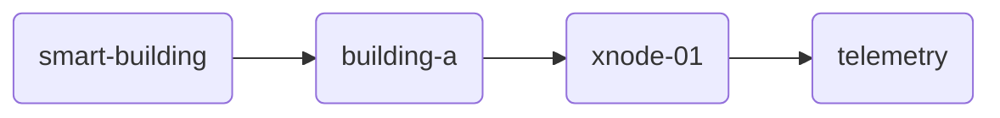
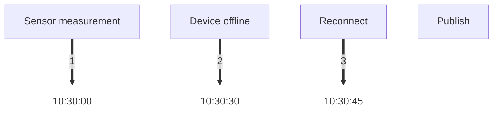
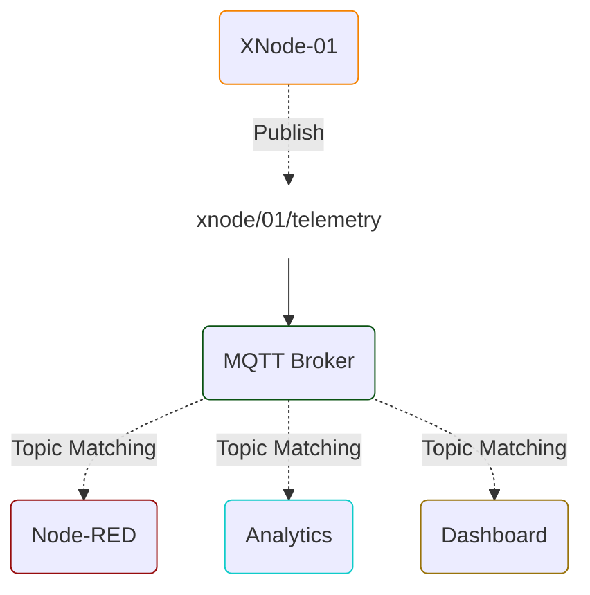
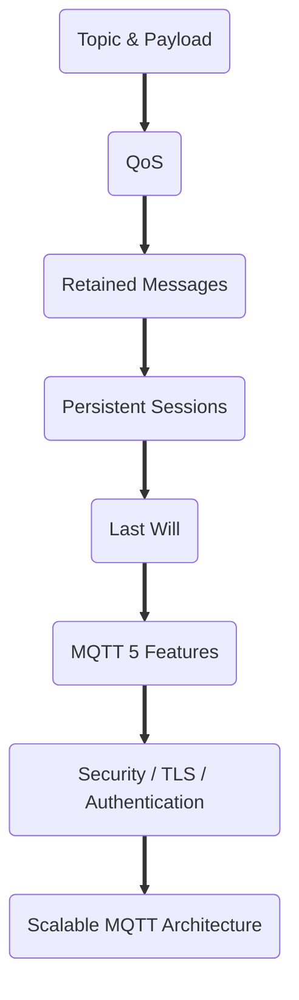

# راهنمای جامع طراحی Topic، Topic Filter، Wildcard و Payload در MQTT

> **سطح:** مقدماتی تا متوسط  
> **مخاطب:** دانشجویان، توسعه‌دهندگان IoT، مهندسان Embedded، طراحان Backend و معماران سیستم  
> **جایگاه در معماری IoT:** لایه ارتباطات و Messaging، با اثر مستقیم بر Routing، Security، Scalability و Data Modeling

[🇬🇧 English](MQTT Topics and Payload Design (EN).md)
---

# 1. چرا Topic و Payload مهم‌اند؟

در MQTT فقط انتخاب پروتکل کافی نیست. بعد از انتخاب MQTT، باید مشخص کنیم:

- پیام‌ها با چه ساختاری آدرس‌دهی بشن؟ 
- دقیقاً چطوری Subscriberها پیام موردنظرشون رو دریافت کنن؟
- چطور Topicها با زیادشدن تعداد دستگاه‌ها قابل مدیریت باقی بمونن؟
- داده‌ها داخل Payload چطوری مدل بشن؟
- چه اطلاعاتی باید در Topic باشه و چه اطلاعاتی در Payload؟
- به چه‌شکل Telemetry، Command، Status و Response رو از هم جدا کنیم؟
- استفاده از Wildcardها کجا مفیدن و کجا خطرناک می‌شن؟
- چگونه ساختار Topic رو طوری طراحی کنیم که بعداً تغییر معماری هزینه زیادی ایجاد نکنه؟

در MQTT،‌ بخش **Topic Name** جزئی از مکانیزم مسیریابی (Routing) پیامه و **Payload** محتوای Application Message رو حمل می‌کنه.

> [!IMPORTANT] یک اصل مهم:
> ** وظیفه Topic اینه که به Broker کمک کنه تا بفهمه پیام متعلق به کدوم مسیر/دسته/گیرنده هست؛ Payload باید داده و Context موردنیاز مصرف‌کننده رو حمل کنه.**

---

# 2. MQTT Topic چیست؟

یک رشته UTF-8 هست که برای شناسایی و مسیریابی پیام‌ها استفاده می‌شه.

مثلاً:

```text
xmind/xnode-01/telemetry
```

یا:

```text
factory/building-a/line-2/device-17/telemetry
```

یک Topic از چند **Topic Level** تشکیل می‌شه و `/` جداکننده Levelهاست.

مثلاً:

```text
factory/building-a/line-2/device-17/telemetry
       │          │       │        │
       │          │       │        └── نوع پیام
       │          │       └────────── شناسه دستگاه
       │          └────────────────── خط تولید
       └───────────────────────────── محیط/ساختار
```

>[!IMPORTANT] نکته مهم:
> خود MQTT الزامی نداره که Topic رو از قبل ایجاد کنیم. در خیلی از Brokerها، Topic به‌صورت منطقی هنگام Publish/Subscribe استفاده می‌شه و نیازی به ایجاد دستی Topic مثل یک Queue سنتی نیست.

## آیا باید همه چیز رو در Topic بگذاریم؟

❌**خیر.**

این Topic:

```text
iran/tehran/building-12/floor-3/room-8/device-001/temperature
```

اطلاعات زیادی داره.

اما:

>[!QUESTION] سؤال اینجاست: 
آیا واقعاً مشترک برای مسیریابی به همه این اطلاعات نیاز داره؟

اگه Application بتونه Device ID رو به Metadata زیر نگاشت کنه:

```text
device-001
→ Tehran
→ Building 12
→ Floor 3
→ Room 8
```

ممکنه Topic ساده‌تر باشه:

```text
devices/device-001/telemetry
```

و Metadata در Registry / Database نگهداری بشه.


## چه چیزی رو در Topic نگذاریم؟

یک اشتباه رایج اینه که مقدار داده رو وارد Topic کنیم.

مثلاً:

```text
xnode/01/temperature/24.6
```

و:

```text
xnode/01/humidity/58
```

🚩 این طراحی معمولاً مناسب نیست.

✅بهتر:

```text
xnode/01/telemetry
```

و:

```json
{
  "temperature": 24.6,
  "humidity": 58
}
```


این یک تصمیم معماریه، نه یک قانون مطلق.

# 3. Payload چیست؟

یک Payload بخش Application Data در پیام MQTT هست.

خود MQTT به‌طور کلی فرمت محتوای Payload رو برای Application شما تعیین نمی‌کنه.

می‌شه Payload رو با فرمت‌های مختلف طراحی کرد، از جمله:

- JSON
- CBOR
- MessagePack
- Protobuf
- Binary Custom Format
- Text
- CSV-like formats

انتخاب فرمت به نیاز سیستم بستگی داره.


# 4. Topic و Payload چه تفاوتی دارند؟

فرض کنید XNode داده‌های محیطی رو ارسال می‌کنه.

### Topic

```text
xmind/xnode-01/telemetry
```

### Payload

```json
{
  "temperature": 24.6,
  "humidity": 58.2,
  "light": 320
}
```

Topic می‌گه:

> این پیام مربوط به Telemetry دستگاه XNode-01 هست.

Payload می‌گه:

> مقدار Temperature برابر 24.6، رطوبت 58.2 و نور 320 هست.

> [!PRINCIPLE] اصل:
> **Routing information → Topic**  
> **Message context / application data → Payload**

---

# 5. Topic Name در برابر Topic Filter

این دو مفهوم رو نباید با هم قاطی کرد.

## Topic Name

اسم واقعی Topic هست که Publisher موقع ارسال پیام استفاده می‌کنه.

مثلاً:

```text
devices/xnode-01/telemetry
```

و Publisher پیام رو به همین Topic منتشر می‌کنه.

## Topic Filter

عبارتیه که Subscriber هنگام Subscribe مشخص می‌کنه.

مثلاً:

```text
devices/xnode-01/telemetry
```

یا:

```text
devices/+/telemetry
```

یا:

```text
devices/#
```

یک Topic Filter می‌تونه Wildcard داشته باشه.

### قانون کلیدی

**یک Wildcard فقط در Subscription / Topic Filter استفاده می‌شه، نه در Topic Name مربوط به Publish.**

✅یعنی این درسته:

```text
SUBSCRIBE devices/+/telemetry
```

❌اما این برای Publish درست نیست:

```text
PUBLISH devices/+/telemetry
```

---

# 6. Wildcardها

در MQTT دو Wildcard اصلی وجود داره:

| Wildcard | معنی |
|---|---|
| `+` | دقیقاً یک Topic Level |
| `#` | صفر یا چند Topic Level |

## Single-Level Wildcard: `+`

فرض کنین Topicهای زیر رو داریم:

```text
sensor/01/temperature
sensor/02/temperature
sensor/03/temperature
```

با این Subscription:

```text
sensor/+/temperature
```

هر سه پیام دریافت می‌شن.

اما:

```text
sensor/01/temperature/indoor
```

مطابقت نداره، چون `+` فقط یک سطح (Level) رو پوشش می‌ده.

#### مثال دیگه

```text
factory/+/temperature
```

می‌تونه این‌ها رو تطبیق بده:

```text
factory/line-1/temperature
factory/line-2/temperature
factory/line-3/temperature
```

ولی:

```text
factory/line-1/zone-a/temperature
```

رو تطبیق نمی‌ده.

---

##  Multi-Level Wildcard: `#`

`#` می‌تونه چند سطح رو Match کنه و باید آخرین سطح در Topic Filter باشه.

مثلاً:

```text
sensor/#
```

می‌تونه این‌ها رو تطبیق بده:

```text
sensor/01
sensor/01/temperature
sensor/01/status
sensor/02/temperature
sensor/02/status
```

حتی خود Topic سطح پایه هم می‌تونه Match بشه:

```text
sensor
```

#### مثال

```text
devices/xnode-01/#
```

یعنی همه Topicهای زیرمجموعه `xnode-01`.

❌اما این‌ها معتبر نیستن:

```text
sensor/#/temperature
sensor/temperature#
sensor/#/status
```

---

### چرا `#` می‌تونه خطرناک باشه؟

این Subscription:

```text
#
```

عملاً می‌تونه همه پیام‌های تطابق‌پذیر در فضای Topic رو دریافت کنه؛ البته Topicهای شروع‌شده با `$` قواعد خاص خودشون رو دارن.

در محیط آزمایشی شاید مفید باشه، اما در سیستم Production می‌تونه باعث:

- دریافت حجم زیادی پیام
- مصرف RAM/CPU
- افزایش Network Traffic
- پردازش غیرضروری
- ایجاد ریسک امنیتی
- وابستگی شدید سرویس به کل Topic Namespace

بشه.

بنابراین:

>[!NOTE] نکته
> **از Wildcard برای هدف مشخص استفاده کن، نه برای راحتی.**

مثلاً به جای:

```text
#
```

اگه فقط Telemetry دستگاه‌ها نیازه:

```text
devices/+/telemetry
```

بهتره.

##   **فشار معماری روی Broker (CPU & Memory):** 
از نظر ساختار داخلی Broker، همه Subscriptionها در یک ساختار درختی به نام **Trie / Routing Tree** نگهداری می‌شن. وقتی کلاینت‌های زیادی روی `#` یا Wildcardهای عمیق Subscribe می‌کنن، فرایند تطابق (Matching) پیام‌ها برای Broker به‌شدت سنگین و CPU-Bound می‌شه و می‌تونه توان عملیاتی (Throughput) کل سیستم رو کاهش بده.

---

# 7. Topicهای شروع‌شده با `$`

از Topicهایی که با `$` شروع می‌شن، معمولاً برای قابلیت‌های داخلی Broker یا سرویس‌های خاص استفاده می‌شه.

مثلاً خیلی  از Brokerها Topicهایی با ساختار `$SYS/...` دارن.

اما 
> [!IMPORTANT] نکته مهم:
> بکارگیری `$SYS` یک ساختار استانداردشده کامل در خود MQTT نیست و جزئیاتش می‌تونه به Broker وابسته باشه.

همچنین توی استاندارد MQTT، موضوعاتی که با علامت **$** شروع می‌شن قانون‌های خاص خودشون رو دارن. اگه موقع اشتراک گرفتن، اول الگوی جستجو(Filter) از علامت‌های **#** یا **+** استفاده بشه، این علامت‌ها معمولاً Topicهایی که با $ شروع می‌شن رو پوشش نمیدن و پیامی دریافت نمی‌شه.
بنابراین Topicهای سیستمی Broker رو با Namespace مربوط به کاربری (Application) خود قاطی نکنین.

---

# 8. Topicها Case-Sensitive هستن

این دو Topic یکی نیستن:

```text
XNode/01/Telemetry
```

و:

```text
xnode/01/telemetry
```

همچنین:

```text
sensor/temperature
```

با:

```text
sensor/Temperature
```

متفاوته.

برای جلوگیری از اشتباه، بهتره یک الگوی نام‌گذاری مشخص داشته باشین.

پیشنهاد عملی:

```text
lowercase
```

و در صورت نیاز:

```text
kebab-case
```

مثلاً:

```text
smart-building/building-a/device-01/telemetry
```

بهتر از ساختارهای نامنظم و ترکیبیه.

---

# 9. آیا Topic با `/` شروع بشه؟

از نظر MQTT، مواردی مثل:

```text
/device/01/telemetry
```

معتبرن.

اما معمولاً شروع Topic با `/` توصیه نمی‌شه، چون یک سطح خالی در ابتدای ساختار ایجاد می‌کنه و می‌تونه در طراحی، ACL و خوانایی سردرگمی ایجاد کنه.

به‌جای:

```text
/device/01/telemetry
```

معمولاً:

```text
device/01/telemetry
```

شفاف‌تره.

---

# 10. ساختار Topic باید از کل به جزء طراحی بشه

یک الگوی رایج:

```text
application/location/device/message-type
```

مثلاً:

```text
smart-building/building-a/xnode-01/telemetry
```

از چپ به راست:





این ساختار به Subscriber اجازه می‌ده در سطوح مختلف مشترک بشه.

مثلاً فقط یک دستگاه:

```text
smart-building/building-a/xnode-01/telemetry
```

همه دستگاه‌های یک ساختمان:

```text
smart-building/building-a/+/telemetry
```

همه Telemetry ساختمان‌ها:

```text
smart-building/+/+/telemetry
```

این قابلیت یکی از دلایل اصلی اهمیت طراحی Topic هست.

---

# 11. Device ID رو کجا قرار بدیم؟

در بیشتر معماری‌های IoT بهتره شناسه یکتا یا Device ID بخشی از Topic باشه.

مثلاً:

```text
devices/xnode-01/telemetry
devices/xnode-02/telemetry
devices/xnode-03/telemetry
```

👍مزیت:


- **مسیریابی راحت‌تر پیام‌ها**
- **عضویت (Subscription) و دریافت دقیق‌تر اطلاعات**
- **تنظیم ساده‌ترِ سطح دسترسی‌ها (ACL)**
- **عیب‌یابی و رفع مشکلِ (Debugging) آسون‌تر**
- **امکان هدف قرار دادن مستقیم (Target) یک دستگاه خاص**
- **امکان مدیریت و انتخاب دسته‌ای تمام دستگاه‌ها**

مثلاً:

```text
devices/+/telemetry
```

یا:

```text
devices/xnode-01/#
```

---

# 12. Telemetry و Command رو جدا کنیم

یکی از اشتباهات مهم، مخلوط‌کردن انواع پیام در یک Namespace هست.

مثلاً:

```text
devices/xnode-01/data
```

و بعد داخل Payload مشخص کنیم که پیام:

- Temperature
- Status
- Command
- Error
- Configuration

هست.

این کار همیشه غلط نیست، ولی در سیستم‌های بزرگ می‌تونه مسیریابی و مجوزدهی رو پیچیده کنه.

ساختار واضح‌تر:

```text
devices/xnode-01/telemetry
devices/xnode-01/status
devices/xnode-01/command
devices/xnode-01/response
```

یا در معماری‌های بزرگ‌تر:

```text
telemetry/devices/xnode-01
commands/devices/xnode-01
status/devices/xnode-01
responses/devices/xnode-01
```

>[!IMPORTANT]  نکته مهم:
> مهم‌تر از انتخاب دقیق یکی از این دو، **ثبات در کل سیستمه**.


## **چرا جداسازی `telemetry` و `status` از نظر پروتکل حیاتیه؟**

علت اصلی این جداسازی، نحوه برخورد Broker با **پیام‌های ذخیره‌شده** -**Retained Messages**- و **پیام قطع ارتباط** -**LWT (Last Will and Testament)**- هست:

- **Topicهای Status:** 
معمولاً با `Retain = true` ارسال می‌شن تا به محض اتصال یک کلاینت جدید (مثلاً Dashboard یا Backend)، آخرین وضعیت آنلاین/آفلاین بودن دستگاه بدون منتظر موندن دریافت بشه. همچنین پیام LWT روی همین Topic تنظیم می‌شه.
    
- **Topicهای Telemetry:** 
نباید به‌صورت ذخیره شده ارسال بشن؛ چون که اتصال مجدد یک کلاینت نباید باعث پردازش دوباره داده‌های سنتی یا تکراری سنسورها در Backend بشن.

---

# 13. استفاده از JSON؛ انتخاب خوب یا بد برای Payload؟

فرمت JSON خیلی رایجه، چون:

- خواناس.
- عیب‌یابی کردنش ساده‌اس.
- ابزارهای زیادی ازش پشتیبانی می‌کنن.
- سیستم‌های سمت سرور(Backend) به راحتی می‌تونن این اطلاعات رو تجزیه و پردازش (Parse) کنن.
- برای توسعه و Prototype مناسبه.
- برای Rules Engineها می‌تونه خیلی کاربردی باشه.

مثلاً:

```json
{
  "temperature": 24.6,
  "humidity": 58.2
}
```

🚩 اما JSON همیشه بهترین انتخاب نیست.

در دستگاهی با:

- RAM خیلی کم
- CPU ضعیف
- پهنای باند محدود
- باتری محدود
- حجم پیام بالا
- نرخ ارسال زیاد

ممکنه فرمت Binary مناسب‌تر باشه.

---

# 14. بی‌دلیل Payload رو بزرگ نکنیم

فرض کنین هر 10 ثانیه این پیام رو می‌فرستیم:

```json
{
  "device_name": "XNode-Aero-01",
  "device_type": "environmental-weather-node",
  "manufacturer": "XminD",
  "temperature_celsius": 24.6,
  "humidity_percent": 58.2,
  "light_lux": 320
}
```

اگه اطلاعاتی مثل سازنده و توع دستگاه در هر پیام ثابت باشن و سیستم اون‌ها رو از روی Device ID بشناسه، تکرارشون در همه پیام‌ها می‌تونه بی‌دلیل حجم ترافیک رو زیاد کنه.

ممکنه این بهتر باشه:

```json
{
  "t": 24.6,
  "h": 58.2,
  "l": 320
}
```

اما این کار در کنار مزایاش، یه سری معایب و محدودیت هم داره:

### کوتاه‌تر

```json
{"t":24.6,"h":58.2,"l":320}
```

### خواناتر

```json
{
  "temperature": 24.6,
  "humidity": 58.2,
  "light": 320
}
```

برای Prototype و سیستم‌های کم‌حجم، خوانایی معمولاً ارزش زیادی داره.

برای دستگاه‌هایی که سخت‌افزار یا منابع محدودی دارن، می‌شه سراغ فرمت‌ها و کدگذاری‌های فشرده‌تر داده رفت.

---

# 15. Unit رو کجا قرار بدیم؟

این مسئله باید در Schema مشخص بشه.

مثلاً:

```json
{
  "temperature": 24.6
}
```

اما آیا این مقدار Celsius هست یا Fahrenheit؟

سه روش رایج:

### روش 1 — نام‌گذاری مشخص

```json
{
  "temperature_c": 24.6
}
```

### روش 2 —قالب داده‌(Schema) مشخص و ثابت
```text
temperature → Celsius
```

نیازی به ارسال Unit در هر پیام نیست.

### روش 3 — Unit داخل Payload

```json
{
  "temperature": {
    "value": 24.6,
    "unit": "C"
  }
}
```

روش سوم انعطاف‌پذیرتر ولی پرحجم‌تره.

برای سیستم‌های IoT که تغییرات ناگهانی ندارن و مدیریت‌شون دست خودتونه، معمولاً داشتن یک قالب داده‌ مشخص و ثابت انتخاب بهتریه.

---

# 16. Timestamp رو فراموش نکنیم

برای Telemetry معمولاً دونستن زمان اندازه‌گیری مهمه.

مثلاً:

```json
{
  "timestamp": "2026-08-15T12:30:00Z",
  "temperature": 24.6,
  "humidity": 58.2
}
```

> [!QUESTION] اما یک سؤال مهم:
> این Timestamp مربوط به زمان اندازه‌گیریه یا زمان ارسال؟

این دو می‌تونن متفاوت باشن.

مثلاً:



اگه Timestamp رو هنگام انتشار داده تولید کنیم، زمان واقعی اندازه‌گیری رو از دست می‌دیم.

پس در سیستم‌هایی که تأخیر یا Offline شدن مهمه، بهتره مفهوم Timestamp دقیقاً تعریف بشه.

---

# 17.  Command/Response

برای Command، در Payload معمولاً فقط مقدار فرمان نیست و ممکنه به Metadata برای Tracking نیاز داشته باشه.

مثلاً:

```text
commands/xnode-01
```

با Payload:

```json
{
  "command": "set_interval",
  "value": 30,
  "unit": "seconds",
  "session_id": "abc-123"
}
```

یا در سیستم Request/Response:

```json
{
  "session_id": "abc-123",
  "response_topic": "responses/xnode-01"
}
```

وجود شناسه درخواست می‌تونه کمک کنه تا Response رو به Request مربوط کنیم.

در سیستم‌های بزرگ، فقط Topic کافی نیست.

فرض کنین Application چند Command به دستگاه می‌فرسته:

```text
set_interval
reboot
set_threshold
```

اگه پاسخ‌ها ناهمگام(asynchronous) باشن، باید بدونیم هر پاسخ یا Response مربوط به کدوم درخواسته.

پس می‌تونیم از:

```json
{
  "session_id": "req-8f21",
  "command": "reboot"
}
```

استفاده کنیم.

و Response:

```json
{
  "session_id": "req-8f21",
  "status": "success"
}
```

این مفهوم رو می‌تونیم **Correlation** در نظر بگیریم.

>[!NOTE] **نکته معماری (MQTT 3.1.1 در برابر MQTT 5.0):**
>روش قرار دادن `session_id` یا `response_topic` داخل Payload قالب JSON، الگوی استاندارد **MQTT 3.1.1** هست.
>
>اما اگه از **MQTT 5.0** استفاده می‌کنین، نیازی نیس داده‌های مسیریابی رو در Payload وارد کنین. در MQTT 5.0 دو ویژگی بومی (Native) در هدر پیام (Packet Properties) اضافه شده:
>1. **Response Topic:**
>مشخص می‌کنه پاسخ باید به چه Topicی ارسال بشه.  
>
>2. **Correlation Data:** 
>معادل `session_id` یا `request_id` هست که به‌صورت بومی توسط Broker و کلاینت‌ها حمل می‌شه.

---

# 18. یک Topic Namespace واقعی برای XNode

فرض کنیم XNode-Aero داریم.

یک طراحی اولیه می‌تونه این باشه:

```text
xmind/xnode/{device_id}/telemetry
xmind/xnode/{device_id}/status
xmind/xnode/{device_id}/command
xmind/xnode/{device_id}/response
```

مثلاً:

```text
xmind/xnode/xnode-aero-01/telemetry
xmind/xnode/xnode-aero-01/status
xmind/xnode/xnode-aero-01/command
xmind/xnode/xnode-aero-01/response
```

### Telemetry

```json
{
  "timestamp": "2026-08-15T12:30:00Z",
  "temperature": 24.6,
  "humidity": 58.2,
  "light": 320
}
```

### Status

```json
{
  "online": true,
  "firmware": "1.2.0",
  "wifi_rssi": -61,
  "uptime": 86400
}
```

### Command

```json
{
  "session_id": "cmd-001",
  "command": "set_interval",
  "value": 30
}
```

### Response

```json
{
  "session_id": "cmd-001",
  "status": "success"
}
```

---

# 19. با Wildcard چه کارهایی می‌تونیم بکنیم؟

با ساختار بالا:

### همه پیامهای یک دستگاه

```text
xmind/xnode/xnode-aero-01/#
```

### Telemetry همه دستگاه‌ها

```text
xmind/xnode/+/telemetry
```

### Status همه دستگاه‌ها

```text
xmind/xnode/+/status
```

این نشان می‌ده چرا Topic Design باید قبل از توسعه جدی گرفته بشه.

---

# 20. Extensibility؛ از امروز برای فردا طراحی کن

فرض کن امروز فقط Telemetry داری:

```text
xmind/xnode/{id}/telemetry
```

فردا نیاز داری:

- status
- command
- response
- event
- alarm
- configuration

اگر از اول Namespace منطقی نداشته باشی، احتمالاً Topicها به ساختارهای ناسازگار تبدیل می‌شن.

یک Namespace قابل توسعه:

```text
xmind/xnode/{id}/telemetry
xmind/xnode/{id}/status
xmind/xnode/{id}/command
xmind/xnode/{id}/response
xmind/xnode/{id}/event
xmind/xnode/{id}/alarm
xmind/xnode/{id}/config
```

---

# 21. Topic را برای Security هم طراحی کن

یک Topic فقط برای مسیریابی یا Routing نیست؛ در خیلی از Brokerها امکان تعریف ACL بر اساس Topic وجود داره.

مثلاً:

```text
devices/xnode-01/telemetry
```

ممکنه برای دستگاه اجازه انتشار داشته باشه.

ولی:

```text
devices/xnode-01/command
```

ممکنه فقط برای Backend اجازه انتشار داشته باشه.

این جداسازی می‌تونه مدیریت و چیدمان دسترسی رو خیلی ساده‌تر کنه.

بنابراین: **Topic Namespace بخشی از ساختار امنیتیه، نه فقط یک قرارداد نامگذاری.**

---

# 22. الگوی Fan-in (تجمیع چند ورودی در یک مقصد) رو درنظر بگیر

فرض کنید 10,000 دستگاه داریم و همه داده‌هاشون رو به یک Topic واحد بفرستیم:

```text
all-devices/telemetry
```

ممکنه از نظر مسیریابی ساده به نظر برسه، اما در سمت مصرف‌کننده و Broker می‌تونه الگوهای Fan-in شدیدی ایجاد کنه.

ساختار Device-aware:

```text
devices/{device_id}/telemetry
```

امکان فیلترکردن و توزیع دقیق‌تر رو فراهم می‌کنه.

در معماری‌های بزرگ، باید ظرفیت Broker، تعداد مشترکین، توان عملیاتی و محدودیت‌های سرویس مورد استفاده هم بررسی بشه.

---

# 23. اشتراک گروهی (Shared Subscription) 

در MQTT 5 مفهوم Shared Subscription  استاندارد شده.

فرمت کلی:

```text
$share/{group}/{topic-filter}
```

مثلاً:

```text
$share/analytics/devices/+/telemetry
```

اگه چند مشترک عضو یک Shared Subscription باشن، هر پیام منطبق با Topic Filter به یکی از اعضای گروه تحویل داده می‌شه. نحوه انتخاب مشترک بر عهده Broker هست و الزاماً نوبتی/چرخشی (Round Robin) نیست.

این می‌تونه برای توزیع بار (Load Balancing) مصرف‌کننده‌ها مفید باشه.

مثلاً:

```text
                 ┌── Consumer 1
MQTT Broker ─────┼── Consumer 2
                 └── Consumer 3
```

در حالی که اشتراک عادی باعث می‌شه هر Consumer یک نسخه از پیام رو دریافت کنه.

از Shared Subscription باید با توجه به نیاز واقعی سیستم استفاده کرد و جزئیات پشتیبانی Broker رو هم بررسی کرد.

---

# 24. الگوی طراحی Topic پیشنهادی

برای خیلی از پروژه‌های IoT، این الگو نقطه شروع خوبیه:

```text
<domain>/<device-id>/<message-type>
```

مثلاً:

```text
xnode/xnode-01/telemetry
xnode/xnode-01/status
xnode/xnode-01/command
xnode/xnode-01/response
```

برای سیستم بزرگ‌تر:

```text
<application>/<site>/<device-type>/<device-id>/<message-type>
```

مثلاً:

```text
smart-building/tehran/xnode/xnode-01/telemetry
```

اما نباید بدون دلیل Topic رو عمیق کنیم.

---

# 25. چک‌لیست طراحی Topic

قبل از نهایی‌کردن Topic Namespace این سؤال‌ها رو جواب بدین:

- [ ] **آیا ساختار Topicها درست و قابل‌مدیریته؟**
- [ ] آیا برای نام‌گذاری Topicها **یک الگوی مشخص** داریم؟
- [ ] آیا **بزرگ و کوچک بودن حروف** رو یکدست رعایت کردیم؟
- [ ] آیا **شناسه دستگاه** در جای مناسبی قرار گرفته؟
- [ ] آیا **داده‌های دستگاه** و **دستورهای کنترلی** از هم جدا شده‌ان؟
- [ ] آیا Topicها از **کلی به جزئی** مرتب شده‌ان؟
- [ ] آیا این ساختار با **تعداد زیادی دستگاه** هم قابل استفاده‌اس؟
- [ ] آیا می‌دونیم کجا باید از **Wildcard**ها (`+` و `#`) استفاده کنیم؟
- [ ] آیا استفاده از `#` را به **موارد ضروری و کنترل‌شده** محدود کردیم؟
- [ ] آیا Topicهای سیستمی که با `$` شروع می‌شن رو از Topicهای برنامه **جدا نگه داشتیم؟**
- [ ] آیا اطلاعات اضافی رو از نام Topic **حذف کردیم؟**
- [ ] آیا ساختار Topicها برای **تعیین سطح دسترسی کاربران و دستگاه‌ها** مناسبه؟
- [ ] آیا این ساختار با **محدودیت‌های Broker یا سرویس ابری** که استفاده می‌کنیم سازگاره؟
- [ ] آیا **ساختار نام‌گذاری Topicها رو مستند کردیم؟**

---

# 26. چک‌لیست طراحی Payload

- [ ] **آیا ساختار پیام‌ها (Schema) درست و مشخصه؟**
- [ ] آیا مشخصه هر **بخش از پیام** چه نوع داده‌ای داره؟
- [ ] آیا **واحد اندازه‌گیری** هر مقدار مشخصه؟ مثلاً °C، % و lux
- [ ] آیا **زمان ثبت داده (Timestamp)** داخل پیام مشخص شده؟
- [ ] آیا تفاوت بین **زمان اندازه‌گیری داده** و **زمان ارسال پیام** مشخصه؟
- [ ] آیا پیام‌ها (Payload) **بیش از حد بزرگ و سنگین** نیستن؟
- [ ] آیا استفاده از **JSON** برای این دستگاه مناسبه؟
- [ ] اگه حجم و سرعت پیام مهمه، آیا **روش‌های کم‌حجم‌تر برای ارسال داده** بررسی شده‌ان؟ مثلاً Binary Encoding
- [ ] آیا برای تغییرات آینده، **نسخه ساختار پیام** در نظر گرفته شده؟
- [ ] آیا برای دستورها، **شناسه‌ای برای ارتباط دادن درخواست و پاسخ** داریم؟ (Correlation ID)
- [ ] آیا برای **پیام‌های خطا** یک ساختار مشخص داریم؟
- [ ] آیا اطلاعاتی که همیشه ثابت‌ان و **بی‌دلیل در همه پیام‌ها تکرار نمی‌شن؟**

---

# 27. ❌اشتباهات رایج

## اشتباه 1

```text
temperature/24.5
```

بهتر:

```text
device/01/telemetry
```

با:

```json
{"temperature":24.5}
```

## اشتباه 2

استفاده از Topicهای خیلی عمیق بدون نیاز واقعی.

## اشتباه 3

ترکیب Telemetry و Command در یک Namespace مبهم.

## اشتباه 4

استفاده از `#` برای همه Clientها.

## اشتباه 5

نداشتن استاندارد نامگذاری.

## اشتباه 6

قرار دادن داده‌های حجیم یا متغیر در Topic.

## اشتباه 7

نداشتن قالب مشخص برای پیام (Payload).

## اشتباه 8

تکرار اطلاعات ثابت در همه Payloadها.

## اشتباه 9

نادیده گرفتن Topic Namespace به‌عنوان بخشی از امنیت.

## اشتباه 10

طراحی Topic فقط برای امروز، بدون فکر به دستگاه‌های بیشتر و انواع پیام‌های جدید.

---

# 28. تمرین 1 — طراحی Topic

برای یک سیستم گلخانه‌ای با مشخصات زیر Topic طراحی کنید:

- 3 گلخانه
- هر گلخانه 20 دستگاه
- هر دستگاه:
  - دما
  - رطوبت
  - نور
  - وضعیت
- بخش Backend باید Telemetry همه دستگاه‌ها رو دریافت کنه.
- هر دستگاه باید فقط Commandهای خودش رو دریافت کنه.

### سؤال

ساختار Topic شما به چه شکله؟

یک پاسخ احتمالی:

```text
greenhouse/{greenhouse_id}/{device_id}/telemetry
greenhouse/{greenhouse_id}/{device_id}/status
greenhouse/{greenhouse_id}/{device_id}/command
```

مثلاً:

```text
greenhouse/gh01/node07/telemetry
```

---

# 29. تمرین 2 — Wildcard

با ساختار زیر:

```text
greenhouse/gh01/node07/telemetry
greenhouse/gh01/node08/telemetry
greenhouse/gh02/node01/telemetry
```

برای هر هدف Subscription مناسب بنویسید:

1. فقط Telemetry دستگاه `node07` در `gh01`
2. Telemetry تمام دستگاه‌های `gh01`
3. Telemetry همه گلخانه‌ها
4. همه پیام‌های `node07` در `gh01`

### پاسخ

1.

```text
greenhouse/gh01/node07/telemetry
```

2.

```text
greenhouse/gh01/+/telemetry
```

3.

```text
greenhouse/+/+/telemetry
```

4.

```text
greenhouse/gh01/node07/#
```

---

# 30. تمرین 3 — Topic یا Payload؟

برای هر مورد تصمیم بگیرید در Topic باشه یا Payload:

| داده            |     Topic | Payload |
| --------------- | --------: | ------: |
| Device ID       | معمولاً ✓ |   ممکنه |
| Temperature     | معمولاً ✗ |       ✓ |
| Humidity        | معمولاً ✗ |       ✓ |
| Message Type    |         ✓ |   ممکنه |
| Session ID      | معمولاً ✗ |       ✓ |
| Routing Context |         ✓ |   ممکنه |
| Timestamp       |         ✗ |       ✓ |

>[!NOTE] نکته: 
>این جدول قانون مطلق نیست؛ تصمیم نهایی به معماری سیستم بستگی داره.

---

# 31. یک ساختار ساده



کارگزار (Broker) بر اساس Topic Filterهای مشترکین تصمیم می‌گیره پیام به کدوم بخش‌ها تحویل داده بشه.

---

# 32. نکته معماری مهم

نباید طراحی Topic  رو صرفاً مسئله توسعه‌دهنده در نظر گرفت.

یک Namespace خوب روی این بخش‌ها اثر داره:

```text
Topic Design
    │
    ├── Routing - مسیریابی
    ├── Subscription - اشتراک
    ├── Wildcards
    ├── ACL / Security - میزان دسترسی / امنیت
    ├── Scalability - مقیاس‌پذیری
    ├── Monitoring - نظارت
    ├── Debugging - عیب‌یابی
    ├── Data Processing - پردازش داده
    └── Future Extensibility - توسعه‌پذیری در آینده
```

پس بهتره Topic Namespace قبل از توسعه گسترده، مستند و بازبینی بشه.

---

# 33. جمع‌بندی

اگه بخوایم کل مطلب رو تو چند اصل خلاصه کنیم:

- یک **Topic** مسیر منطقی پیام رو مشخص می‌کنه؛ بنابراین ساختارش رو از اول درست طراحی کنین.
- یک **Topic Filter** الگوییه که Subscriber برای مشخص‌کردن پیام‌های موردنظرش استفاده می‌کنه.
- `+` فقط **یک سطح** از Topic رو جایگزین می‌کنه.
- `#` می‌تونه **چند سطح** رو پوشش بده و باید در انتهای Topic Filter قرار بگیره.
- از `+` و `#` برای **دریافت پیام‌ها (Subscribe)** استفاده می‌شه، نه برای ارسال پیام (Publish).
- حروف بزرگ و کوچک در Topicها **متفاوت محسوب می‌شن**؛ پس نام‌گذاری رو یکدست انجام بدین.
- ساختار Topic رو از **کلی به جزئی** طراحی کنین.
- اطلاعات مربوط به **مسیر و دسته‌بندی پیام** رو در Topic و اطلاعات خود پیام رو عمدتاً در Payload قرار بدین.
- **داده‌های اندازه‌گیری، دستورها، وضعیت دستگاه و پاسخ‌ها** رو در مسیرهای مشخص و جدا از هم قرار بدین.
- ساختار Topicها روی **کنترل دسترسی** (ACL) تأثیر داره؛ پس هنگام طراحی، امنیت رو هم در نظر بگیرین.
- از `#` فقط وقتی استفاده کنین که واقعاً به **دریافت پیام‌های متعدد** نیاز دارین؛ مخصوصاً روی دستگاه‌ها و سرویس‌های اصلی.
- از ابتدا مشخص کنین **ساختار داده داخل پیام** چگونه هست و اون رو مستند کنین.
- فرمت JSON خوانا و رایجه، اما برای دستگاه‌های محدود از نظر **حافظه، توان پردازشی یا حجم ارتباط** همیشه بهترین گزینه نیست.
- بسته به نیاز پروژه، مواردی مثل **زمان ثبت داده، واحد اندازه‌گیری، نسخه پیام و شناسه ارتباط درخواست و پاسخ** رو مشخص کنین.
- هر Topic و ساختار پیام رو طوری طراحی کنین که با **افزایش تعداد دستگاه‌ها و تغییرات آینده** به مشکل نخورین.

---

# 34. منابع

- OASIS — MQTT Version 5.0 Specification
- HiveMQ — MQTT Essentials: Topics, Wildcards & Best Practices
- HiveMQ — MQTT Topics, Wildcards & Best Practices
- EMQX — MQTT Topics and Wildcards
- AWS — Designing MQTT Topics for AWS IoT Core
- AWS — MQTT Message Payload
- AWS — MQTT Topics and Topic Filters

## منابع آنلاین

- https://docs.oasis-open.org/mqtt/mqtt/v5.0/mqtt-v5.0.html
- https://www.hivemq.com/blog/mqtt-essentials-part-5-mqtt-topics-best-practices/
- https://dev.to/hivemq_/mqtt-topics-wildcards-best-practices-part-5-87g
- https://www.emqx.com/en/blog/advanced-features-of-mqtt-topics
- https://docs.aws.amazon.com/whitepapers/latest/designing-mqtt-topics-aws-iot-core/mqtt-design-best-practices.html
- https://docs.aws.amazon.com/iot/latest/developerguide/topicdata.html
- https://docs.aws.amazon.com/iot/latest/developerguide/topics.html

---

## پیشنهاد برای ادامه یادگیری

بعد از این موضوع، منطقی‌ترین مسیر یادگیری MQTT این:



