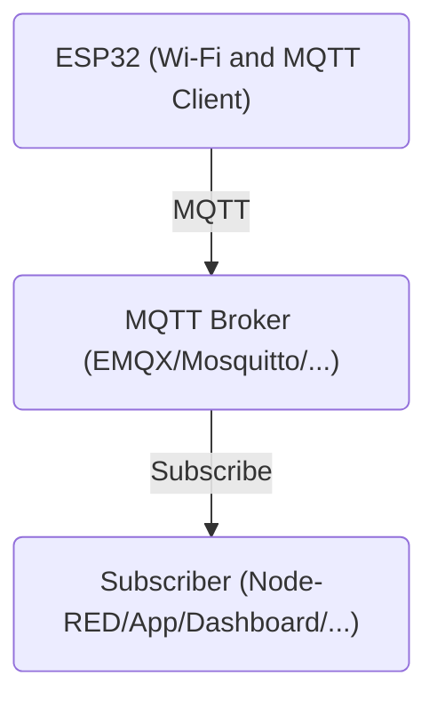

<p align="center">

  <picture>
    <source media="(prefers-color-scheme: dark)" srcset="../../assets/EduminD_dark.webp">
    <source media="(prefers-color-scheme: light)" srcset="../../assets/EduminD.webp">
    
  </picture>

</p>

<div align="center">
  <a href="https://t.me/X_MindWorld" target="_blank">
    
  </a>
  <a href="https://instagram.com/x_mindworld" target="_blank">
    
  </a>
  <a href="mailto:education.xmindworld@gmail.com" target="_blank">
    
  </a>
</div>


[🇬🇧 English](README.md)
# نود تله‌متری MQTT (آموزشی)

یک پروژه آموزشی مبتنی بر **ESP32** برای نمایش نحوه برقراری ارتباط Wi-Fi، ارتباط MQTT، مدیریت وضعیت دستگاه و ارسال دوره‌ای داده‌های تله‌متری.

## معرفی

پروژه **MQTT Telemetry Node** یک نود سبک IoT مبتنی بر ESP32 هست که با هدف آموزش و نمایش عملی مفاهیم ارتباطی در سیستم‌های IoT طراحی شده.

تمرکز این نسخه از پروژه روی ارتباط بین ESP32 و MQTT Broker هست و مفاهیم زیر رو پوشش می‌ده:

- شناسایی دستگاه در MQTT
- ارسال داده‌های Telemetry
- مدیریت وضعیت Online / Offline دستگاه
- استفاده از MQTT Last Will and Testament یا LWT
- استفاده از Retained Message
- تلاش مجدد برای اتصال Wi-Fi
- تلاش مجدد برای اتصال MQTT
- ارسال دوره‌ای Telemetry
- استفاده از پیام‌های JSON

در نسخه فعلی، مقادیر دما و رطوبت به‌صورت شبیه‌سازی‌شده تولید می‌شن و از سنسور فیزیکی خونده نمی‌شن.

---

## معماری پروژه




در ابتدا ESP32 به شبکه Wi-Fi متصل می‌شه و بعد یک اتصال MQTT با Broker برقرار می‌کنه.

بعد از اتصال موفق، دستگاه وضعیتش رو `online` اعلام می‌کنه و بعد داده‌های Telemetry رو در فواصل مشخص منتشر می‌کنه.

❗ برای نصب بروکر EMQX می‌تونین از فایل `docker-compose` موجود در این 
[**Directory**](../docker_compose)
استفاده کنید!


---

## قابلیت‌ها

### اتصال به Wi-Fi

در این مرحله ESP32 در حالت Station به شبکه Wi-Fi متصل می‌شه.

اطلاعات شبکه از فایل `secrets.h` خونده می‌شند.

برای اتصال اولیه یک Timeout در نظر گرفته شده. اگه دستگاه در مدت مشخص‌شده نتونه به Wi-Fi متصل بشه، ESP32 ری‌استارت می‌شه.

در زمان اجرای عادی هم اگه اتصال Wi-Fi قطع بشه، دستگاه به‌صورت دوره‌ای برای برقراری مجدد اتصال تلاش می‌کنه.

---

## ارتباط MQTT

برای ارتباط MQTT از کتابخونه `PubSubClient` استفاده شده.
ا
طلاعات مربوط به MQTT Broker شامل:

- آدرس Broker
- Port
- Username
- Password

در فایل `secrets.h` قرار دارن.

هر دستگاه با یک شناسه مشخص در سیستم MQTT معرفی می‌شه:
```text
xnode-aero-01
```

---

## Topicهای MQTT

این پروژه در نسخه فعلی از دو Topic اصلی استفاده می‌کنه.

### وضعیت دستگاه

```text
xmind/xnode/xnode-aero-01/status
```

این Topic وضعیت فعلی دستگاه رو مشخص می‌کنه.

پس از برقراری موفق اتصال MQTT، دستگاه پیام زیر رو منتشر می‌کنه:
```json
{
  "state": "online",
  "firmware": "v1.0.4"
}
```

این پیام به‌صورت **Retained Message** منتشر می‌شه.

بنابراین Subscriber جدید هم می‌تونه آخرین وضعیت ثبت‌شده دستگاه رو بلافاصله دریافت کنه.

---

### Telemetry

```text
xmind/xnode/xnode-aero-01/telemetry
```

داده‌های Telemetry به‌صورت دوره‌ای و در قالب JSON منتشر می‌شن:
```json
{
  "temp": 24.6,
  "hum": 58.2
}
```

❗ در نسخه فعلی، مقادیر دما و رطوبت داخل برنامه شبیه‌سازی شده‌ان و از سنسور واقعی دریافت نمی‌شند.

---

## MQTT Last Will and Testament

یکی از قابلیت‌های مهم این پروژه استفاده از **MQTT Last Will and Testament یا LWT** هست.

برای دستگاه یک پیام Will تعریف شده:

```json
{
  "state": "offline",
  "reason": "unexpected_disconnect"
}
```

در صورتی که ارتباط دستگاه با Broker به‌صورت غیرمنتظره قطع بشه، Broker می‌تونه این پیام رو منتشر کنه.

پیام LWT با **QoS 1** و به‌صورت **Retained** تنظیم شده.

این قابلیت به سیستم‌هایی مثل Node-RED اجازه می‌ده متوجه بشن که دستگاه به‌صورت غیرمنتظره از دسترس خارج شده.

---

## استراتژی Reconnection

برنامه برای جلوگیری از تلاش‌های مداوم و بدون فاصله برای برقراری اتصال، از Interval مشخص استفاده می‌کنه.

مقادیر فعلی:
```cpp
MQTT_RECONNECT_INTERVAL = 5000;
WIFI_RECONNECT_INTERVAL = 10000;
```

یعنی:

| مورد  | فاصله تلاش مجدد |
| ----- | --------------: |
| MQTT  |         ۵ ثانیه |
| Wi-Fi |        ۱۰ ثانیه |

این روش باعث می‌شه دستگاه در زمان قطع ارتباط، دائماً درخواست اتصال جدید ارسال نکنه.

---

## فاصله ارسال Telemetry

در نسخه فعلی، داده‌های Telemetry هر `5 ثانیه` ارسال می‌شن.

این مقدار توسط متغیر زیر کنترل می‌شه:
```cpp
TELEMETRY_INTERVAL = 5000;
```

برای مدیریت زمان‌بندی ارسال Telemetry از `millis()` استفاده شده.

---

## مدیریت اطلاعات حساس

اطلاعات حساس اتصال در فایل جداگونه‌ای به اسم:

```text
secrets.h
```

قرار گرفته‌ان.

برای مثال:
```cpp
namespace Secrets {
    inline constexpr char WIFI_SSID[] = "...";
    inline constexpr char WIFI_PASS[] = "...";

    inline constexpr char MQTT_BROKER[] = "...";
    inline constexpr int   MQTT_PORT = 1883;

    inline constexpr char MQTT_USER[] = "...";
    inline constexpr char MQTT_PASS[] = "...";
}
```

🚩**اطلاعات واقعی Wi-Fi و MQTT رو در Repository عمومی قرار ندید.**

در صورت استفاده از Git، فایل حاوی Credentialها رو در صورت نیاز به `.gitignore` اضافه کنین.

---

## کتابخانه‌های موردنیاز

این پروژه از موارد زیر استفاده می‌کند:

- `Arduino.h`
- `WiFi.h`
- `PubSubClient`
- فایل اختصاصی `secrets.h`

کتابخانه `PubSubClient` برای ارتباط MQTT موردنیازه.

---

## جریان پیام‌های MQTT

```text
ESP32
  │
  │ Connect
  ▼
MQTT Broker
  │
  ├── Retained: online
  │
  ├── Telemetry ─────────► Subscriber
  │
  │
  └── قطع غیرمنتظره
           │
           ▼
      پیام LWT
        offline
```

---

## اهداف آموزشی پروژه

این پروژه با هدف آموزش نحوه پیاده‌سازی یک نود IoT طراحی شده و مفاهیم زیر رو به‌صورت عملی نشون می‌ده:

1. اتصال ESP32 به Wi-Fi
2. برقراری ارتباط MQTT
3. استفاده از Device ID
4. انتشار وضعیت دستگاه
5. استفاده از Retained Message
6. استفاده از MQTT LWT
7. ارسال Telemetry در قالب JSON
8. مدیریت قطع و وصل شبکه
9. جداسازی اطلاعات حساس از منطق برنامه
10. ایجاد پایه‌ای برای توسعه یک سیستم Telemetry کامل‌تر

---

## ایده‌های توسعه

این پروژه در حال حاضر هسته ارتباطی یک نود IoT رو فراهم می‌کنه و می‌شه قابلیت‌های بیشتری بهش اضافه کرد.

برخی توسعه‌های پیشنهادی:

- اتصال سنسور واقعی دما و رطوبت
- اضافه‌کردن نمایشگر OLED
- اضافه‌کردن پارامترهای بیشتر به Telemetry
- اضافه‌کردن MQTT Subscription برای دریافت Command
- کنترل LED از طریق MQTT
- ارسال Uptime دستگاه
- ارسال RSSI شبکه Wi-Fi
- مدیریت بهتر نسخه Firmware
- ایجاد سیستم گزارش خطای ساختاریافته
- استفاده از MQTT روی TLS
- اتصال به Node-RED، InfluxDB و Grafana

---

## ساختار پیشنهادی پروژه

ساختار پروژه می‌تواند به شکل زیر باشد:

```text
MQTT_Telemetry_Node/
│
├── src/
│   └── main.cpp
│   └── secrets.h
│
├── README.md
├── .gitignore
└── platformio.ini
```

ساختار دقیق پوشه‌ها بسته به محیط توسعه مورد استفاده می‌تونه متفاوت باشه.

---

## زمینه آموزشی

این پروژه بخشی از اکوسیستم آموزشی **XminD** هست و با هدف آموزش مفاهیم عملی IoT و MQTT از طریق یک نمونه ساده و قابل اجرا روی ESP32 توسعه داده شده.

این پروژه می‌تونه نقطه شروع مناسبی برای یادگیری و آزمایش سیستم‌های Telemetry مبتنی بر MQTT و مدیریت وضعیت دستگاه‌های IoT باشه.

---

## سازنده

**XminD Education Team (EduminD)**

Education: `education.xmindworld@gmail.com`

کانال‌های رسمی:

[https://linkshub.xmindworld.ir](https://linkshub.xmindworld.ir)

---

## مجوز و حقوق استفاده (License)

### نرم‌افزار

کدهای نرم‌افزاری این Repository تحت **مجوز MIT** منتشر شده‌اند.

متن کامل مجوز در فایل `LICENSE` قرار دارد.

مجوز MIT به شما اجازه می‌دهد کد را استفاده، کپی، تغییر، ادغام و توزیع کنید؛ از جمله در پروژه‌های تجاری، مشروط بر اینکه اطلاعیه‌های مربوط به کپی‌رایت و مجوز حفظ شوند.

### سخت‌افزار

در صورتی که فایل‌های طراحی سخت‌افزار در این Repository ارائه شده باشند، این فایل‌ها به‌صورت جداگانه تحت **CERN-OHL-P-2.0** منتشر خواهند شد، مگر اینکه برای بخشی از پروژه مجوز دیگری به‌طور صریح مشخص شده باشد.

بنابراین مجوز MIT را نباید به‌صورت خودکار برای فایل‌های طراحی سخت‌افزار، شماتیک، PCB، فایل‌های ساخت یا سایر Design Fileهای سخت‌افزاری اعمال‌شده در نظر گرفت.

### مستندات

مستندات، آموزش‌ها و محتوای متنی این پروژه، مگر اینکه خلاف آن به‌طور مشخص ذکر شده باشد، تحت **Creative Commons Attribution 4.0 International (CC BY 4.0)** منتشر می‌شوند.

استفاده، بازنشر و اقتباس از این محتوا مجاز است، مشروط بر اینکه انتساب مناسب به XminD ارائه شود.

### نام تجاری و برند

نام‌ها و علائم زیر بخشی از هویت برند XminD محسوب می‌شوند:

- **XminD**
- **XNode**
- **XNode-Aero**
- **EduminD**
- **ProminD**
- لوگوها و سایر Brand Assetهای مرتبط

مجوزهای Open Source این پروژه، به‌خودی‌خود مجوزی برای استفاده از نام، لوگو یا سایر دارایی‌های برند XminD صادر نمی‌کنند.

به‌طور خاص، استفاده از این نام‌ها یا لوگوها نباید به شکلی باشد که وجود **تأیید، Certification، حمایت یا وابستگی رسمی به XminD** را القا کند.

استفاده از کد این پروژه در Forkها و پروژه‌های مشتق‌شده آزاد است؛ با این حال، نسخه‌های تغییر‌یافته نباید به‌عنوان **نسخه رسمی XminD** معرفی شوند.

برای مثال، استفاده از عباراتی مانند موارد زیر قابل قبول است:

> Based on XNode-Aero by XminD

یا:

> Forked from the XminD XNode-Aero project

اما استفاده از عباراتی مانند موارد زیر مجاز نیست، مگر با اجازه صریح XminD:

> XminD Official XNode-Aero Pro

یا:

> XNode-Aero Certified by XminD

### توجه

این بخش، سیاست استفاده از مجوزها و برند پروژه را مشخص می‌کند و جایگزین مشاوره حقوقی تخصصی نیست.


<p align="center">

  <picture>
    <source media="(prefers-color-scheme: dark)" srcset="../../assets/XminD_logo_dark.webp">
    <source media="(prefers-color-scheme: light)" srcset="../../assets/XminD_logo.webp">
    
  </picture>

</p>

<div align="center">
  <a href="https://t.me/X_MindWorld" target="_blank">
    
  </a>
  <a href="https://instagram.com/x_mindworld" target="_blank">
    
  </a>
  <a href="mailto:education.xmindworld@gmail.com" target="_blank">
    
  </a>
</div>
