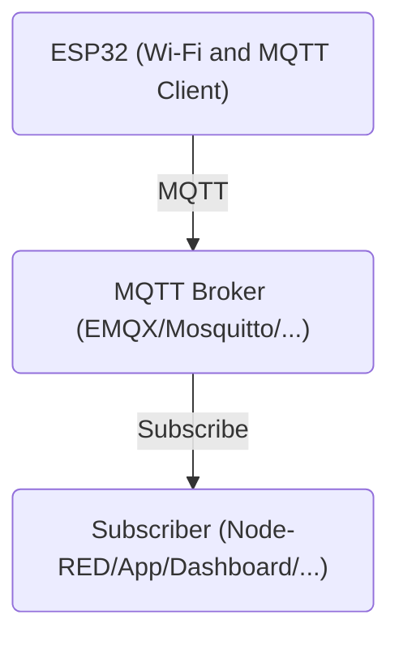

<p align="center">

  <picture>
    <source media="(prefers-color-scheme: dark)" srcset="../../assets/EduminD_dark.webp">
    <source media="(prefers-color-scheme: light)" srcset="../../assets/EduminD.webp">
    
  </picture>

</p>

<div align="center">
  <a href="https://t.me/X_MindWorld" target="_blank">
    
  </a>
  <a href="https://instagram.com/x_mindworld" target="_blank">
    
  </a>
  <a href="mailto:education.xmindworld@gmail.com" target="_blank">
    
  </a>
</div>


[🇮🇷 فارسی](README-FA.md)
# XNode-Aero MQTT Telemetry Node

An educational ESP32-based IoT node demonstrating reliable MQTT communication, device status management, and periodic telemetry publishing.

## Overview

**XNode-Aero MQTT Telemetry Node** is a lightweight ESP32 project designed to demonstrate the fundamentals of connecting an IoT device to a Wi-Fi network and communicating with an MQTT broker.

The project focuses on practical MQTT concepts such as:

- MQTT device identification
- Telemetry publishing
- Device online/offline status
- MQTT Last Will and Testament (LWT)
- Retained messages
- Automatic Wi-Fi reconnection
- Automatic MQTT reconnection
- Periodic telemetry transmission
- JSON-formatted MQTT payloads

The current implementation uses simulated temperature and humidity values to demonstrate the communication workflow. Sensor integration can be added later without changing the core MQTT architecture.

---

## Architecture




The ESP32 connects to the local Wi-Fi network and establishes an MQTT connection with the broker.

Once connected, the device publishes its status as `online` and periodically sends telemetry data.

❗ To install the EMQX broker, you can use the `docker-compose` file available in this [**Directory**](https://github.com/X-Mind-World/EduminD-Contents/tree/main/MQTT/docker_compose).


---

## Features

### Wi-Fi Connectivity

The ESP32 operates in Wi-Fi Station mode and connects using credentials defined in `secrets.h`.

The initial connection has a timeout. If the device cannot establish the initial Wi-Fi connection within the configured period, it restarts.

During normal operation, if the Wi-Fi connection is lost, the device periodically attempts to reconnect.

### MQTT Communication

The project uses the `PubSubClient` library for MQTT communication.

The MQTT broker address, port, username, and password are loaded from `secrets.h`.

The device uses a unique identifier:

```text
xnode-aero-01
```

---

## MQTT Topics

The project currently uses two MQTT topics.

### Device Status

```text
xmind/xnode/xnode-aero-01/status
```

This topic represents the current state of the device.

When the device connects successfully, it publishes:

```json
{
  "state": "online",
  "firmware": "v1.0.4"
}
```

The message is published as a **retained message**, allowing a new subscriber to immediately receive the latest known device state.

---

### Telemetry

```text
xmind/xnode/xnode-aero-01/telemetry
```

Telemetry is periodically published as JSON:

```json
{
  "temp": 24.6,
  "hum": 58.2
}
```

The current values are simulated inside the code and are not yet read from physical sensors.

---

## MQTT Last Will and Testament

The project implements MQTT **Last Will and Testament (LWT)** to indicate an unexpected device disconnection.

The configured LWT payload is:

```json
{
  "state": "offline",
  "reason": "unexpected_disconnect"
}
```

The LWT is configured as a retained message with QoS 1.

This allows MQTT clients such as Node-RED to determine that the device became unexpectedly disconnected.

---

## Reconnection Strategy

The project does not continuously attempt MQTT connections without delay.

Instead, it uses configurable reconnection intervals:

```cpp
MQTT_RECONNECT_INTERVAL = 5000;
WIFI_RECONNECT_INTERVAL  = 10000;
```

This reduces unnecessary connection attempts and provides a more controlled recovery mechanism.

The MQTT connection is attempted immediately when required and subsequent attempts are limited by the configured interval.

---

## Telemetry Interval

Telemetry is published every: `5 seconds`

This value is controlled by:
```cpp
TELEMETRY_INTERVAL = 5000;
```

The timing mechanism uses `millis()` rather than blocking the main loop with a long `delay()`.

---

## Configuration

Sensitive connection credentials are kept outside the main source file in: `secrets.h
`
A typical configuration contains:

```cpp
namespace Secrets {
    inline constexpr char WIFI_SSID[] = "...";
    inline constexpr char WIFI_PASS[] = "...";

    inline constexpr char MQTT_BROKER[] = "...";
    inline constexpr int   MQTT_PORT = 1883;

    inline constexpr char MQTT_USER[] = "...";
    inline constexpr char MQTT_PASS[] = "...";
}
```

🚩Do **not** commit real Wi-Fi or MQTT credentials to a public repository.

For Git repositories, add the credentials file to `.gitignore` when appropriate.

---

## Required Libraries

The project uses:

- `Arduino.h`
- `WiFi.h`
- `PubSubClient`
- A project-specific `secrets.h`

`PubSubClient` is required for MQTT communication.

---

## MQTT Message Flow

```text
ESP32
  │
  │ Connect
  ▼
MQTT Broker
  │
  ├── Retained: online
  │
  ├── Telemetry ─────────► Subscriber
  │
  │
  └── Unexpected disconnect
           │
           ▼
      Retained LWT
         offline
```

---

## Project Learning Objectives

This project is intended to demonstrate how an IoT device can:

1. Connect to a Wi-Fi network.
2. Establish an MQTT connection.
3. Identify itself using a device ID.
4. Publish device state.
5. Use retained MQTT messages.
6. Implement MQTT LWT.
7. Publish JSON telemetry.
8. Recover from network failures.
9. Separate credentials from application logic.
10. Build a foundation for a larger IoT telemetry system.

---

## Possible Extensions

The current project provides the communication foundation for a more complete IoT node.

Possible next steps include:

- Adding real temperature and humidity sensors
- Adding an OLED display
- Adding additional telemetry fields
- Adding MQTT subscriptions for device commands
- Implementing remote LED control
- Adding device uptime and RSSI
- Adding firmware version management
- Adding structured error reporting
- Adding TLS-secured MQTT communication
- Integrating with Node-RED, InfluxDB, and Grafana


---

## Project Structure

A possible project structure is:

```text
MQTT_Telemetry_Node/
│
├── src/
│   └── main.cpp
│   └── secrets.h
│
├── README.md
├── .gitignore
└── platformio.ini
```

The exact structure may vary depending on the development environment.

---

## Educational Context

This project is part of the **XminD** educational ecosystem and is intended to demonstrate practical IoT and MQTT concepts through a small, reproducible ESP32 example.

It can be used as a starting point for experimenting with MQTT-based telemetry systems and device state management.

---

## Author

**XminD Education Team (EduminD)**

Education: `education.xmindworld@gmail.com`

Official channels:

[https://linkshub.xmindworld.ir](https://linkshub.xmindworld.ir)

---

## License

### Software

The software source code in this repository is licensed under the MIT License.

### Hardware

Hardware design files, if included, are licensed separately under CERN-OHL-P-2.0.

### Documentation

Unless otherwise stated, documentation is licensed under CC BY 4.0.

### Trademarks

XminD, XNode, XNode-Aero, EduminD, ProminD and associated logos and brand assets are trademarks or
protected brand assets of XminD.

The open-source license does not grant permission to use XminD trademarks,
logos, or branding in a way that implies endorsement, certification, or official
affiliation.

Forks and modified versions must not be presented as official XminD projects.


<p align="center">

  <picture>
    <source media="(prefers-color-scheme: dark)" srcset="../../assets/XminD_logo_dark.webp">
    <source media="(prefers-color-scheme: light)" srcset="../../assets/XminD_logo.webp">
    
  </picture>

</p>

<div align="center">
  <a href="https://t.me/X_MindWorld" target="_blank">
    
  </a>
  <a href="https://instagram.com/x_mindworld" target="_blank">
    
  </a>
  <a href="mailto:education.xmindworld@gmail.com" target="_blank">
    
  </a>
</div>

