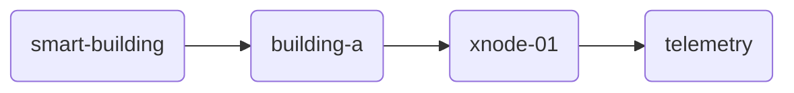
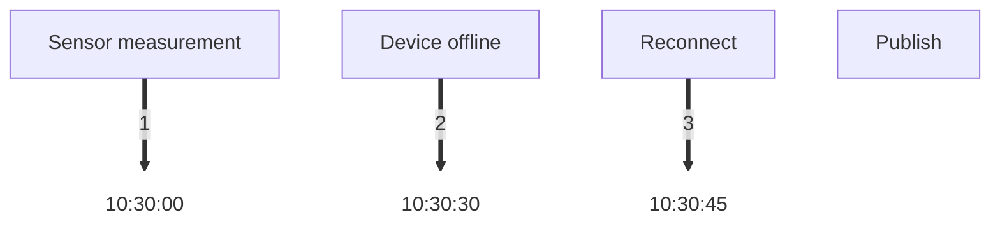
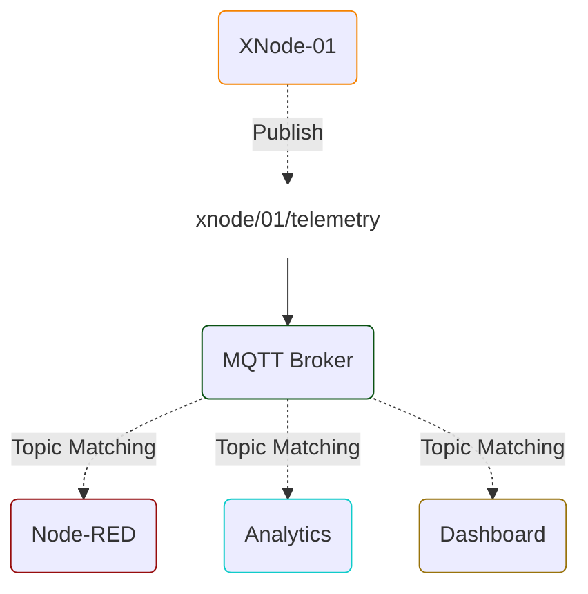
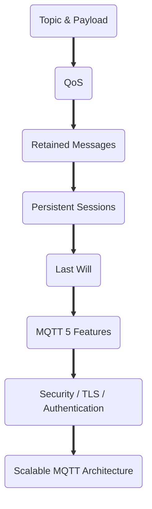

<p align="center">

  <picture>
    <source media="(prefers-color-scheme: dark)" srcset="../assets/EduminD_dark.webp">
    <source media="(prefers-color-scheme: light)" srcset="../assets/EduminD.webp">
    
  </picture>

</p>
<div align="center">
  <a href="https://t.me/X_MindWorld" target="_blank">
    
  </a>
  <a href="https://instagram.com/x_mindworld" target="_blank">
    
  </a>
  <a href="mailto:education.xmindworld@gmail.com" target="_blank">
    
  </a>
</div>

## **Comprehensive Guide to Topic, Topic Filter, Wildcard, and Payload Design in MQTT**

[🇮🇷 فارسی](README_FA.md)

> **Level:** Beginner to Intermediate
> 
> **Audience:** Students, IoT Developers, Embedded Engineers, Backend Designers, and System Architects
> 
> **Role in IoT Architecture:** Communication and Messaging Layer, with a direct impact on Routing, Security, Scalability, and Data Modeling

# 1. Why Are Topics and Payloads Important?

In MQTT, choosing the protocol alone is not enough. After selecting MQTT, we must define:

- What structure should be used to address messages?
- Exactly how should Subscribers receive their intended messages?
- How can Topics remain manageable as the number of devices grows?
- How should data inside the Payload be modeled?
- What information should reside in the Topic vs. the Payload?
- How do we separate Telemetry, Command, Status, and Response?
- Where are Wildcards useful, and where do they become dangerous?
- How do we design the Topic structure so that future architectural changes won't incur high costs?

In MQTT, the **Topic Name** is part of the message routing mechanism, while the **Payload** carries the Application Message content.


> [!IMPORTANT] A Core Principle:
> 
> **The Topic's job is to help the Broker understand which route/category/recipient a message belongs to; the Payload should carry the data and Context required by the consumer.**
> 
>   

# 2. What Is an MQTT Topic?

An MQTT Topic is a UTF-8 string used to identify and route messages.

For example:
```
xmind/xnode-01/telemetry
```

Or:
```
factory/building-a/line-2/device-17/telemetry
```

A Topic consists of one or more **Topic Levels**, with `/` serving as the level separator.

For example:
```
factory/building-a/line-2/device-17/telemetry
       │          │       │        │
       │          │       │        └── Message Type
       │          │       └────────── Device ID
       │          └────────────────── Production Line
       └───────────────────────────── Environment / Structure
```

> [!IMPORTANT] Key Note:
> 
> MQTT itself does not require topics to be pre-created. In many Brokers, Topics are used logically during Publish/Subscribe, eliminating the need to manually create a Topic like a traditional queue.
> 
>   

## Should We Put Everything in the Topic?

❌ **No.**

This Topic:
```
iran/tehran/building-12/floor-3/room-8/device-001/temperature
```

contains a lot of information.

However:
> [!QUESTION] The question is:
> 
> Does the subscriber really need all of this information for routing?
> 
>   

If the Application can map the Device ID to the following metadata:
```
device-001
→ Tehran
→ Building 12
→ Floor 3
→ Room 8
```

A simpler Topic might suffice:
```
devices/device-001/telemetry
```

while keeping metadata inside a Registry / Database.


## What Should NOT Be Placed in a Topic?

A common mistake is embedding the data value inside the Topic.

For example:
```
xnode/01/temperature/24.6
```

and:
```
xnode/01/humidity/58
```

🚩 This design is generally an anti-pattern.

✅ Better approach:
```
xnode/01/telemetry
```

and in Payload:
```JSON
{
  "temperature": 24.6,
  "humidity": 58
}
```

This is an architectural decision, not an absolute law.

# 3. What Is a Payload?

A Payload represents the Application Data section of an MQTT message.
MQTT itself generally does not enforce payload content formatting for your Application.

Payloads can be designed using various formats, including:

- JSON
- CBOR
- MessagePack
- Protobuf
- Custom Binary Format
- Text
- CSV-like formats

Choosing a format depends on system requirements.

# 4. How Do Topic and Payload Differ?

Suppose XNode transmits environmental data.

### Topic
```
xmind/xnode-01/telemetry
```

### Payload
```JSON
{
  "temperature": 24.6,
  "humidity": 58.2,
  "light": 320
}
```

The Topic says:
> This message belongs to XNode-01's Telemetry.

The Payload says:
> The Temperature value is 24.6, humidity is 58.2, and light is 320.

> [!PRINCIPLE] Principle:
> 
> **Routing information → Topic**
> 
>   
> 
> **Message context / application data → Payload**
> 
>   

# 5. Topic Name vs. Topic Filter

These two concepts should not be confused.

## Topic Name

The actual Topic name used by the Publisher when sending a message.

For example:
```
devices/xnode-01/telemetry
```

The Publisher publishes messages directly to this Topic.

## Topic Filter

An expression specified by the Subscriber when subscribing.

For example:
```
devices/xnode-01/telemetry
```

Or:
```
devices/+/telemetry
```

Or:
```
devices/#
```

A Topic Filter can include Wildcards.


### Key Rule

**Wildcards are used ONLY in Subscriptions / Topic Filters, NEVER in Topic Names for Publishing.**

✅ Valid subscription:
```
SUBSCRIBE devices/+/telemetry
```

❌ Invalid for publish:
```
PUBLISH devices/+/telemetry
```

# 6. Wildcards

MQTT provides two main Wildcards:

|**Wildcard**|**Meaning**|
|---|---|
|`+`|Exactly one Topic Level|
|`#`|Zero or multiple Topic Levels|

## Single-Level Wildcard: `+`

Suppose we have the following Topics:
```
sensor/01/temperature
sensor/02/temperature
sensor/03/temperature
```

With this Subscription:
```
sensor/+/temperature
```

All three messages will be received.

However:
```
sensor/01/temperature/indoor
```

will NOT match because `+` covers only a single level.

#### Another Example

```
factory/+/temperature
```

Matches:
```
factory/line-1/temperature
factory/line-2/temperature
factory/line-3/temperature
```

But does NOT match:
```
factory/line-1/zone-a/temperature
```

## Multi-Level Wildcard: `#`

`#` can match multiple levels and MUST be the last level in a Topic Filter.

For example:
```
sensor/#
```

Matches:
```
sensor/01
sensor/01/temperature
sensor/01/status
sensor/02/temperature
sensor/02/status
```

Even the base topic itself matches:
```
sensor
```

#### Example
```
devices/xnode-01/#
```

Matches all sub-topics under `xnode-01`.

❌ Invalid examples:
```
sensor/#/temperature
sensor/temperature#
sensor/#/status
```

### Why Can `#` Be Dangerous?

This Subscription:
```
#
```

Effectively receives all matching messages across the Topic namespace (except topics starting with `$`, which follow specific rules).

While useful in test environments, in Production systems it can cause:
  
- Excessive message volume
- High RAM/CPU consumption
- Increased network traffic
- Unnecessary processing
- Security risks
- Tight service coupling to the entire Topic Namespace

Therefore:

> [!NOTE] Note
> 
> **Use Wildcards with a specific goal, not just for convenience.**
> 
>   

For example, instead of:
```
#
```

If only device Telemetry is needed:
```
devices/+/telemetry
```

is far better.

## Architectural Load on the Broker (CPU & Memory):

Internally, Brokers store subscriptions in a tree structure known as a **Trie / Routing Tree**. When many clients subscribe to `#` or deep Wildcards, the message matching process becomes heavily CPU-bound for the Broker, potentially reducing overall system throughput.

  
# 7. Topics Starting with `$`

Topics starting with `$` are typically reserved for internal Broker features or special services.

For instance, many Brokers feature `$SYS/...` topic structures.

> [!IMPORTANT] Key Note:
> 
> Using `$SYS` is not a fully standardized structure across all MQTT specifications, and exact details may depend on the specific Broker implementation.
> 
>   

In the MQTT standard, topics beginning with `$` follow special rules. When subscribing, search patterns (Filters) starting with **#** or **+** usually do NOT match `$SYS` or `$` topics, and no messages will be received.

Therefore, do not mix Broker system topics with your Application namespace.

# 8. Topics Are Case-Sensitive

These two Topics are NOT identical:
```
XNode/01/Telemetry
```

And:
```
xnode/01/telemetry
```

Also:
```
sensor/temperature
```

differs from:
```
sensor/Temperature
```

To prevent errors, maintain a consistent naming convention.

  

Practical recommendation:
```
lowercase
```

and if needed:
```
kebab-case
```

For example:
```
smart-building/building-a/device-01/telemetry
```

is better than irregular or hybrid structures.

# 9. Should Topics Start with `/`?

From an MQTT protocol perspective, topics like:
```
/device/01/telemetry
```

are technically valid.
However, starting topics with `/` is generally discouraged because it creates an empty leading topic level, leading to confusion in visual design, ACLs, and readability.

Instead of:
```
/device/01/telemetry
```

Prefer:
```
device/01/telemetry
```

for clarity.

# 10. Topic Structure Should Flow from General to Specific

A common pattern:
```
application/location/device/message-type
```

For example:
```
smart-building/building-a/xnode-01/telemetry
```

From left to right:


This structure allows Subscribers to subscribe at different granularities.

For example, a single device:
```
smart-building/building-a/xnode-01/telemetry
```

All devices in a building:
```
smart-building/building-a/+/telemetry
```

All Telemetry across buildings:
```
smart-building/+/+/telemetry
```

This flexibility is one of the main reasons Topic design is critical.

# 11. Where Should Device ID Be Placed?

In most IoT architectures, a unique identifier or Device ID should be part of the Topic path.

For example:
```
devices/xnode-01/telemetry
devices/xnode-02/telemetry
devices/xnode-03/telemetry
```

👍 Advantages:

- **Easier message routing**
- **Precise subscription and targeted data reception**
- **Simpler Access Control List (ACL) configuration**
- **Easier debugging and troubleshooting**
- **Ability to target a specific device directly**
- **Batch selection and management of all devices**

For example:
```
devices/+/telemetry
```

Or:
```
devices/xnode-01/#
```

# 12. Separate Telemetry and Command

One major mistake is mixing message types into a single ambiguous Namespace.

For example:
```
devices/xnode-01/data
```

and then specifying inside the Payload whether the message is:

- Temperature
- Status
- Command
- Error
- Configuration

While not strictly forbidden, this complicates routing and authorization in large systems.

Clearer structure:
```
devices/xnode-01/telemetry
devices/xnode-01/status
devices/xnode-01/command
devices/xnode-01/response
```

Or in larger architectures:
```
telemetry/devices/xnode-01
commands/devices/xnode-01
status/devices/xnode-01
responses/devices/xnode-01
```

> [!IMPORTANT] Key Note:
> 
> More important than choosing one specific approach over the other is maintaining **consistency across the entire system**.
> 
>   

## **Why is separating `telemetry` and `status` protocol-critical?**

The primary reason lies in how the Broker handles **Retained Messages** and **Last Will and Testament (LWT)**:

- **Status Topics:**

    Usually published with `Retain = true` so that whenever a new client (such as a Dashboard or Backend) connects, it immediately receives the latest online/offline state without waiting. LWT messages are also configured on this Topic.

- **Telemetry Topics:**
  
    Should NOT be published as retained messages, as client reconnections should not trigger the re-processing of stale or duplicate sensor data on the Backend.


# 13. Using JSON: Good or Bad for Payload?

JSON is very popular because:

- It is human-readable.
- Easy to debug.
- Supported by vast tooling.
- Server-side (Backend) systems can easily parse and process it.
- Ideal for prototyping and development.
- Highly practical for Rules Engines.

For example:
```JSON
{
  "temperature": 24.6,
  "humidity": 58.2
}
```

🚩 However, JSON is not always optimal.

On devices with:

- Very limited RAM
- Weak CPU
- Constrained bandwidth
- Battery constraints
- High message volume
- High transmission rates

Binary formats might be more appropriate.


# 14. Do Not Bloat Payloads Unnecessarily

Suppose every 10 seconds we send:
```JSON
{
  "device_name": "XNode-Aero-01",
  "device_type": "environmental-weather-node",
  "manufacturer": "XminD",
  "temperature_celsius": 24.6,
  "humidity_percent": 58.2,
  "light_lux": 320
}
```

If static attributes like manufacturer and device type can be resolved from the Device ID on the server side, repeating them in every payload unnecessarily inflates bandwidth traffic.

This might be better:
```JSON
{
  "t": 24.6,
  "h": 58.2,
  "l": 320
}
```

However, this comes with trade-offs:


### Concise

```JSON
{"t":24.6,"h":58.2,"l":320}
```

### Readable

```JSON
{
  "temperature": 24.6,
  "humidity": 58.2,
  "light": 320
}
```

For prototypes and low-volume systems, readability is often more valuable.

For hardware- or resource-constrained devices, compact binary encodings or short keys are preferred.


# 15. Where to Put Units?

Units should be clearly defined in the schema.

For example:
```JSON
{
  "temperature": 24.6
}
```

Is this Celsius or Fahrenheit?

**Three common methods:**

### Method 1 — Explicit Field Naming

```JSON
{
  "temperature_c": 24.6
}
```

### Method 2 — Fixed System Schema

```
temperature → Celsius
```

No need to send units in every message payload.

### Method 3 — Units Included in Payload

```JSON
{
  "temperature": {
    "value": 24.6,
    "unit": "C"
  }
}
```

Method 3 is flexible but increases payload size.
For controlled IoT systems without abrupt changes, establishing a fixed schema (Method 2) is usually the best balance.

# 16. Do Not Forget Timestamps

For Telemetry, knowing the measurement time is crucial.

For example:
```JSON
{
  "timestamp": "2026-08-15T12:30:00Z",
  "temperature": 24.6,
  "humidity": 58.2
}
```

> [!QUESTION] An Important Question:
> 
> Is this timestamp the measurement time or transmission time?
> 
>   

These two can differ significantly.

For example:


If the timestamp is generated upon publishing, the actual time of measurement is lost during disconnection periods.

In systems where latency or offline buffering matters, explicitly define timestamp semantics.

# 17. Command / Response

For Commands, payloads usually need tracking metadata beyond just the execution parameter.

For example:
```
commands/xnode-01
```

With Payload:
```JSON
{
  "command": "set_interval",
  "value": 30,
  "unit": "seconds",
  "session_id": "abc-123"
}
```

Or in a Request/Response pattern:
```JSON
{
  "session_id": "abc-123",
  "response_topic": "responses/xnode-01"
}
```

A request ID correlates responses back to their originating request.
In large systems, Topic structure alone is insufficient.

Suppose an application sends multiple asynchronous commands:
```
set_interval
reboot
set_threshold
```

If responses arrive asynchronously, we must correlate each response to its specific command.

We can include:
```JSON
{
  "session_id": "req-8f21",
  "command": "reboot"
}
```

And Response:
```JSON
{
  "session_id": "req-8f21",
  "status": "success"
}
```

This concept is known as **Correlation**.

> [!NOTE] **Architectural Note (MQTT 3.1.1 vs. MQTT 5.0):**
> 
> Embedding `session_id` or `response_topic` inside the JSON payload is standard pattern for **MQTT 3.1.1**.
> 
>   
> 
> In **MQTT 5.0**, routing metadata does not need to be forced into the payload. MQTT 5.0 introduces native Packet Properties:
> 
>   
> 
> 1. **Response Topic:**
>     
>       
>     
>     Specifies the exact topic to send responses to.
>     
>       
>     
> 2. **Correlation Data:**
>     
>       
>     
>     Equivalent to `session_id` or `request_id`, carried natively by the Broker and clients.
>     
>       
>     

# 18. A Real Topic Namespace for XNode

Suppose we have an XNode-Aero device.

An initial design:
```
xmind/xnode/{device_id}/telemetry
xmind/xnode/{device_id}/status
xmind/xnode/{device_id}/command
xmind/xnode/{device_id}/response
```

For example:
```
xmind/xnode/xnode-aero-01/telemetry
xmind/xnode/xnode-aero-01/status
xmind/xnode/xnode-aero-01/command
xmind/xnode/xnode-aero-01/response
```

### Telemetry

```JSON
{
  "timestamp": "2026-08-15T12:30:00Z",
  "temperature": 24.6,
  "humidity": 58.2,
  "light": 320
}
```

### Status

```JSON
{
  "online": true,
  "firmware": "1.2.0",
  "wifi_rssi": -61,
  "uptime": 86400
}
```

### Command

```JSON
{
  "session_id": "cmd-001",
  "command": "set_interval",
  "value": 30
}
```

### Response

```JSON
{
  "session_id": "cmd-001",
  "status": "success"
}
```

# 19. What Can We Do with Wildcards?

With the design above:
### All messages for a single device

```
xmind/xnode/xnode-aero-01/#
```

### Telemetry for all devices

```
xmind/xnode/+/telemetry
```

### Status for all devices

```
xmind/xnode/+/status
```

This demonstrates why Topic design must be taken seriously prior to development.

# 20. Extensibility: Design Today for Tomorrow

Suppose today you only have Telemetry:

```
xmind/xnode/{id}/telemetry
```

Tomorrow you need:

- status
- command
- response
- event
- alarm
- configuration

If you lack a logical Namespace from the start, topics quickly degrade into inconsistent structures.

An extensible Namespace:
```
xmind/xnode/{id}/telemetry
xmind/xnode/{id}/status
xmind/xnode/{id}/command
xmind/xnode/{id}/response
xmind/xnode/{id}/event
xmind/xnode/{id}/alarm
xmind/xnode/{id}/config
```

# 21. Design Topics with Security in Mind

Topics aren't just for routing; many Brokers implement Access Control Lists (ACLs) based on topic patterns.


For example:
```
devices/xnode-01/telemetry
```

A device might be granted Publish permission here.

However:
```
devices/xnode-01/command
```

Only Backend services should have Publish permission here.
This separation simplifies security policy management.
Therefore: **Topic Namespace is a key component of security design, not just a naming convention.**

# 22. Consider Fan-In Patterns (Aggregating Inputs into One Destination)

Suppose 10,000 devices send all data to a single topic:
```
all-devices/telemetry
```

While routing seems simple, this creates extreme Fan-In bottlenecks on consumers and Brokers.

A device-aware structure:
```
devices/{device_id}/telemetry
```

enables precise filtering and workload distribution.

In large architectures, consider Broker capacity, subscriber count, throughput, and cloud service limits.

# 23. Shared Subscriptions

MQTT 5.0 standardizes Shared Subscriptions.

General format:
```
$share/{group}/{topic-filter}
```

For example:
```
$share/analytics/devices/+/telemetry
```

When multiple subscribers join a Shared Subscription, matching messages are distributed among group members. Selection logic is handled by the Broker and is not strictly Round Robin.

This provides built-in Load Balancing across consumer instances.

  

For example:
```
                 ┌── Consumer 1
MQTT Broker ─────┼── Consumer 2
                 └── Consumer 3
```

In contrast, standard subscriptions deliver a copy of each message to every subscriber.

Use Shared Subscriptions according to actual system needs and verify Broker compatibility.


# 24. Recommended Topic Design Patterns

For many IoT projects, this pattern is a solid starting point:
```
<domain>/<device-id>/<message-type>
```

For example:
```
xnode/xnode-01/telemetry
xnode/xnode-01/status
xnode/xnode-01/command
xnode/xnode-01/response
```

For larger enterprise systems:
```
<application>/<site>/<device-type>/<device-id>/<message-type>
```

For example:
```
smart-building/tehran/xnode/xnode-01/telemetry
```

Avoid making topics unnecessarily deep without clear justification.


# 25. Topic Design Checklist

Before finalizing your Topic Namespace, answer these questions:

- [ ] **Is the Topic structure logical and manageable?**
- [ ] Do we have a **consistent naming convention**?
- [ ] Is **casing** (lowercase/kebab-case) applied uniformly?
- [ ] Is the **Device ID** placed in a logical hierarchy position?
- [ ] Are **Telemetry data** and **Control commands** separated?
- [ ] Are topics ordered from **general to specific**?
- [ ] Will this structure scale to **thousands of devices**?
- [ ] Do we know where and how to use **Wildcards** (`+` and `#`)?
- [ ] Is the use of `#` restricted to **essential, controlled cases**?
- [ ] Are system topics starting with `$` **separated** from application topics?
- [ ] Has redundant information been **removed** from topic names?
- [ ] Does topic structure support effective **ACL access control**?
- [ ] Is it compatible with **Broker or Cloud Service limitations**?
- [ ] Is the **Topic Naming Convention documented**?


# 26. Payload Design Checklist

- [ ] **Is the Message Schema well-defined?**
- [ ] Are data types explicit for every **field**?
- [ ] Are **Units of Measurement** defined? (e.g., °C, %, lux)
- [ ] Is a **Timestamp** included in the message?
- [ ] Is the distinction between **measurement time** and **publish time** defined?
- [ ] Are Payloads optimized against **excessive size**?
- [ ] Is **JSON** suitable for the target device capabilities?
- [ ] If bandwidth is tight, have **compact formats** (e.g., Binary, Protobuf) been evaluated?
- [ ] Is there a **Schema Versioning** strategy for future updates?
- [ ] Do commands include a **Correlation ID** for request/response tracking?
- [ ] Is there a standardized **Error message** format?
- [ ] Are static device metadata parameters **omitted from recurring payloads**?

# 27. ❌ Common Pitfalls

## Pitfall 1

```
temperature/24.5
```

Better:
```
device/01/telemetry
```

With payload:
```JSON
{"temperature":24.5}
```

## Pitfall 2

Using excessively deep topic hierarchies without actual need.

## Pitfall 3

Mixing Telemetry and Commands in an ambiguous Namespace.

## Pitfall 4

Using `#` subscriptions broadly across client apps.

## Pitfall 5

Lacking a unified naming standard.

## Pitfall 6

Embedding large or rapidly changing dynamic data in Topic strings.

## Pitfall 7

Lacking a defined Payload schema.

## Pitfall 8

Repeating static configuration attributes in every telemetry payload.

## Pitfall 9

Ignoring Topic Namespace as part of system security architecture.

## Pitfall 10

Designing Topic structures strictly for current needs without planning for device growth and new message types.

# 28. Exercise 1 — Topic Design

Design a Topic hierarchy for a greenhouse system with:

- 3 greenhouses
- 20 devices per greenhouse
- Each device reports:
    - Temperature
    - Humidity
    - Light
    - Status
- Backend must consume Telemetry from all devices.
- Each device must receive only its designated Commands.


### Question

What does your Topic structure look like?

Possible solution:
```
greenhouse/{greenhouse_id}/{device_id}/telemetry
greenhouse/{greenhouse_id}/{device_id}/status
greenhouse/{greenhouse_id}/{device_id}/command
```

For example:
```
greenhouse/gh01/node07/telemetry
```

# 29. Exercise 2 — Wildcards

Given this structure:
```
greenhouse/gh01/node07/telemetry
greenhouse/gh01/node08/telemetry
greenhouse/gh02/node01/telemetry
```

Write appropriate Subscriptions for each goal:

1. Telemetry from `node07` in `gh01` only
2. Telemetry from all devices in `gh01`
3. Telemetry across all greenhouses
4. All messages from `node07` in `gh01`

### Solution

```
greenhouse/gh01/node07/telemetry
```

```
greenhouse/gh01/+/telemetry
```

```
greenhouse/+/+/telemetry
```

```
greenhouse/gh01/node07/#
```

# 30. Exercise 3 — Topic or Payload?

Decide whether each item belongs in the Topic or Payload:


|**Data Element**|**Topic**|**Payload**|
|---|---|---|
|Device ID|Usually ✓|Possible|
|Temperature|Usually ✗|✓|
|Humidity|Usually ✗|✓|
|Message Type|✓|Possible|
|Session ID|Usually ✗|✓|
|Routing Context|✓|Possible|
|Timestamp|✗|✓|

> [!NOTE] Note:
> 
> This table is a general guideline; final placement depends on specific system architecture.
> 
>   

# 31. A Simple Architecture Diagram



The Broker routes incoming messages to subscribers based on matching Topic Filters.


# 32. Key Architectural Insight

Topic design should not be viewed solely as a developer preference.

A well-architected Namespace influences:
```
Topic Design
    │
    ├── Routing
    ├── Subscription
    ├── Wildcards
    ├── ACL / Security
    ├── Scalability
    ├── Monitoring
    ├── Debugging
    ├── Data Processing
    └── Future Extensibility
```

Document and review your Topic Namespace prior to large-scale development.

# 33. Summary

Key principles summarized:

- A **Topic** defines the logical message path; design its hierarchy carefully from day one.
- A **Topic Filter** is a pattern used by Subscribers to request matching messages.
- `+` replaces **exactly one** topic level.
- `#` matches **zero or multiple** topic levels and MUST be placed at the end of a Topic Filter.
- `+` and `#` are for **Subscriptions**, never for Publishing.
- Topic names are **Case-Sensitive**; maintain strict naming consistency.
- Design Topic hierarchies from **general to specific**.
- Place **routing and classification context** in the Topic; place **data payloads** in the Payload.
- Keep **Telemetry, Commands, Status, and Responses** in separate topic channels.
- Topic structures directly affect **ACL permissions**; incorporate security into namespace design.
- Restrict `#` wildcard subscriptions to necessary, controlled services.
- Establish and document explicit **Payload Data Schemas**.
- While JSON is popular and human-readable, evaluate compact formats for memory- or bandwidth-constrained edge devices.
- Account for **Timestamps, Units, Schema Versioning, and Correlation IDs** in Payload design.
- Ensure Topic and Payload design accommodates **future device scalability and new feature requirements**.


# 34. References

- OASIS — MQTT Version 5.0 Specification
- HiveMQ — MQTT Essentials: Topics, Wildcards & Best Practices
- HiveMQ — MQTT Topics, Wildcards & Best Practices
- EMQX — MQTT Topics and Wildcards
- AWS — Designing MQTT Topics for AWS IoT Core
- AWS — MQTT Message Payload
- AWS — MQTT Topics and Topic Filters


## Online Resources

- [https://docs.oasis-open.org/mqtt/mqtt/v5.0/mqtt-v5.0.html](https://docs.oasis-open.org/mqtt/mqtt/v5.0/mqtt-v5.0.html)
- [https://www.hivemq.com/blog/mqtt-essentials-part-5-mqtt-topics-best-practices/](https://www.hivemq.com/blog/mqtt-essentials-part-5-mqtt-topics-best-practices/)
- [https://dev.to/hivemq_/mqtt-topics-wildcards-best-practices-part-5-87g](https://dev.to/hivemq_/mqtt-topics-wildcards-best-practices-part-5-87g)
- [https://www.emqx.com/en/blog/advanced-features-of-mqtt-topics](https://www.emqx.com/en/blog/advanced-features-of-mqtt-topics)
- [https://docs.aws.amazon.com/whitepapers/latest/designing-mqtt-topics-aws-iot-core/mqtt-design-best-practices.html](https://docs.aws.amazon.com/whitepapers/latest/designing-mqtt-topics-aws-iot-core/mqtt-design-best-practices.html)
- [https://docs.aws.amazon.com/iot/latest/developerguide/topicdata.html](https://docs.aws.amazon.com/iot/latest/developerguide/topicdata.html)
- [https://docs.aws.amazon.com/iot/latest/developerguide/topics.html](https://docs.aws.amazon.com/iot/latest/developerguide/topics.html)


## Suggested Next Steps in Learning

Recommended learning path following Topic & Payload design:


**XminD-2026**

<p align="center">

  <picture>
    <source media="(prefers-color-scheme: dark)" srcset="../assets/XminD_logo_dark.webp">
    <source media="(prefers-color-scheme: light)" srcset="../assets/XminD_logo.webp">
    
  </picture>

</p>
<div align="center">
  <a href="https://t.me/X_MindWorld" target="_blank">
    
  </a>
  <a href="https://instagram.com/x_mindworld" target="_blank">
    
  </a>
  <a href="mailto:education.xmindworld@gmail.com" target="_blank">
    
  </a>
</div>
