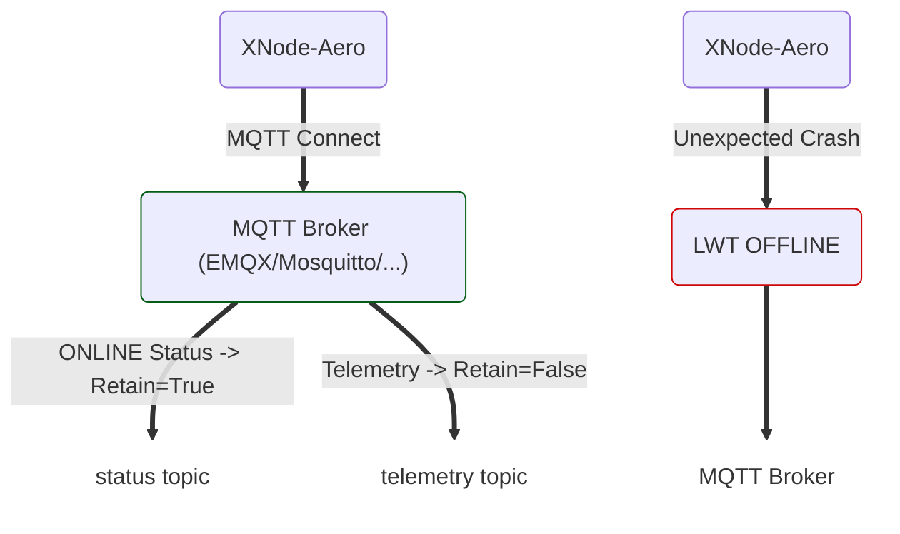

<p align="center">

  <picture>
    <source media="(prefers-color-scheme: dark)" srcset="../../assets/EduminD_dark.webp">
    <source media="(prefers-color-scheme: light)" srcset="../../assets/EduminD.webp">
    
  </picture>

</p>

<div align="center">
  <a href="https://t.me/X_MindWorld" target="_blank">
    
  </a>
  <a href="https://instagram.com/x_mindworld" target="_blank">
    
  </a>
  <a href="mailto:education.xmindworld@gmail.com" target="_blank">
    
  </a>
</div>

# XNode-Aero MQTT LWT Demo

[🇮🇷 فارسی](README_FA.md)

A simple Python example demonstrating how to use **MQTT 5** with the `paho-mqtt` library.

This example focuses on three important MQTT concepts:

- **Last Will and Testament (LWT)**
- **Retained Messages**
- **Telemetry Messages**

The example simulates an IoT device named `xnode-aero-01`. The device connects to an MQTT Broker, publishes its `online` status, and periodically sends telemetry data.

If the device terminates unexpectedly without calling `disconnect()`, the MQTT Broker publishes the configured LWT message and marks the device as `offline`.

---

## Scenario

The device uses two MQTT Topics:

```text
xmind/xnode/xnode-aero-01/status
xmind/xnode/xnode-aero-01/telemetry
```

### Status

Used to publish the current device state:

```text
xmind/xnode/<DEVICE_ID>/status
```

The status message is published with `retain=True`, allowing the Broker to keep the latest device state.

### Telemetry

Used for sensor and telemetry data:

```text
xmind/xnode/<DEVICE_ID>/telemetry
```

Telemetry messages are published with `retain=False`, so the Broker does not retain the latest telemetry value for future Subscribers.

---

## Execution Flow



---

## Requirements

### Python

Python 3.x is required.

### Install Paho MQTT

```bash
python -m pip install paho-mqtt
```

Or:

```bash
pip install paho-mqtt
```

### MQTT Broker

This example assumes that an MQTT Broker is running locally:

```text
localhost:1883
```

You can use an MQTT Broker such as **EMQX** or **Mosquitto**.

---

## Configuration

The main connection settings are:

```python
BROKER = "localhost"
PORT = 1883
DEVICE_ID = "xnode-aero-01"
```

If your Broker is running on another machine, change the `BROKER` value.

For example:

```python
BROKER = "192.168.1.100"
```

The standard port for MQTT without TLS is:

```text
1883
```

---

## Authentication

If your Broker requires a username and password:

```python
client.username_pw_set("YOUR_MQTT_USER", "YOUR_MQTT_PASS")
```

Replace the placeholders with your actual credentials.

If authentication is disabled on your Broker, this line can be removed.

> For production systems, hard-coding credentials in source code is not recommended. Use environment variables or a proper secret-management mechanism instead.

---

# Last Will and Testament

One of the main features demonstrated by this example is **LWT**.

The Will message is configured before connecting to the Broker:

```python
lwt_payload = '{"state": "offline", "reason": "unexpected_crash"}'

client.will_set(
    TOPIC_STATUS,
    payload=lwt_payload,
    qos=1,
    retain=True
)
```

The idea is:

> If the Broker detects that the Client disconnected unexpectedly, publish this message.

The message is:

```json
{
  "state": "offline",
  "reason": "unexpected_crash"
}
```

Its MQTT properties are:

|Property|Value|Purpose|
|---|---|---|
|Topic|`status`|Device state|
|QoS|`1`|More reliable delivery|
|Retain|`True`|Keep the latest state|
|State|`offline`|Unexpected disconnection|

---

# Connecting to the Broker

```python
client.connect(BROKER, PORT, keepalive=10)
client.loop_start()
```

The `keepalive=10` setting defines the MQTT Keep Alive interval used to maintain and monitor the connection.

`loop_start()` starts Paho's network loop in a background thread, allowing MQTT network communication to continue while the main application runs.

---

# Publishing the Online Status

After connecting successfully, the device publishes:

```json
{
  "state": "online",
  "firmware": "v1.0.4"
}
```

using:

```python
client.publish(
    TOPIC_STATUS,
    payload=online_payload,
    qos=1,
    retain=True
)
```

`retain=True` is important here.

If a Subscriber subscribes to the status Topic later, the Broker can immediately provide the latest retained status.

The Subscriber therefore does not need to be connected at the exact moment when the device publishes its `online` status.

---

# Publishing Telemetry

Telemetry is published to a separate Topic:

```python
client.publish(
    TOPIC_TELEMETRY,
    payload=telemetry_payload,
    qos=0,
    retain=False
)
```

Example payload:

```json
{
  "temp": 24.5,
  "hum": 55
}
```

This example uses:

- `QoS = 0`
    
- `retain = False`
    

Telemetry is continuously generated data, so retaining the latest sample is not necessarily required.

---

# Simulating a Crash

To test LWT, the program intentionally terminates when `Ctrl+C` is pressed:

```python
os._exit(1)
```

The important part is that:

```python
client.disconnect()
```

is **not** called before the process terminates.

Therefore, the Broker can detect the unexpected disconnection and publish the LWT message:

```json
{
  "state": "offline",
  "reason": "unexpected_crash"
}
```

> `os._exit(1)` is used only to simulate a crash in this demo. It is not an appropriate way to perform a normal application shutdown.

---

# Testing with MQTT Explorer

You can use **MQTT Explorer** or any MQTT Subscriber to observe the behavior.

Subscribe to:

```text
xmind/xnode/xnode-aero-01/status
```

After starting the program, you should receive:

```json
{
  "state": "online",
  "firmware": "v1.0.4"
}
```

Then press `Ctrl+C`.

After the Broker detects the unexpected disconnection, you should receive the LWT message:

```json
{
  "state": "offline",
  "reason": "unexpected_crash"
}
```

To observe telemetry, subscribe to:

```text
xmind/xnode/xnode-aero-01/telemetry
```

You should receive messages similar to:

```json
{
  "temp": 24.5,
  "hum": 55
}
```

---

# Why Retain Is Different for Status and Telemetry

This example intentionally uses two different behaviors:

```text
/status
    └── Retain = True

/telemetry
    └── Retain = False
```

Why?

**Status** represents a state. Keeping the latest state is often useful.

**Telemetry** represents a stream of measurements. In many systems, you do not want the Broker to replay the last measurement to every new Subscriber.

This is not an absolute rule. The appropriate Retain strategy depends on the application requirements.

---

# Topic Structure

The Topic hierarchy used by this example is:

```text
xmind/
└── xnode/
    └── xnode-aero-01/
        ├── status
        └── telemetry
```

This structure can easily scale to multiple devices:

```text
xmind/xnode/xnode-aero-01/status
xmind/xnode/xnode-aero-01/telemetry

xmind/xnode/xnode-aero-02/status
xmind/xnode/xnode-aero-02/telemetry
```

---

# MQTT Concepts Demonstrated

|Concept|Usage in This Demo|
|---|---|
|MQTT 5|Communication protocol|
|Client ID|Identifies `xnode-aero-01`|
|Username/Password|Optional authentication|
|LWT|Detect unexpected disconnection|
|QoS 1|Status messages|
|QoS 0|Telemetry messages|
|Retain|Keep the latest status|
|Non-Retained|Telemetry messages|
|Keep Alive|Monitor the MQTT connection|
|MQTT Topic|Logical message routing|

---

## Running the Example

After configuring the Broker and credentials:

```bash
python xnode_aero_mqtt.py
```

Example output:

```text
[1] Connecting to EMQX...
[2] Published ONLINE status (Retain=True) to xmind/xnode/xnode-aero-01/status
[3] Published Telemetry #1
[3] Published Telemetry #2
[3] Published Telemetry #3
```

Press `Ctrl+C` to simulate an unexpected crash:

```text
[!] Simulating HARD CRASH (Force Kill)...
```

The Broker should then publish the configured LWT message.

---

## Learning Objectives

This project is a small example of communication between an **IoT Device** and an **MQTT Broker**.

It demonstrates how to:

1. Manage device online/offline status.
2. Keep the latest device status using Retain.
3. Detect unexpected device disconnections using LWT.
4. Publish telemetry as non-retained messages.
5. Separate Status and Telemetry using different MQTT Topics.

---

## License

This project is provided for educational purposes.
**XminD-2026**

<p align="left">

  <picture>
    <source media="(prefers-color-scheme: dark)" srcset="../../assets/XminD_logo_dark.webp">
    <source media="(prefers-color-scheme: light)" srcset="../../assets/XminD_logo.webp">
    
  </picture>

</p>

<div align="center">
  <a href="https://t.me/X_MindWorld" target="_blank">
    
  </a>
  <a href="https://instagram.com/x_mindworld" target="_blank">
    
  </a>
  <a href="mailto:education.xmindworld@gmail.com" target="_blank">
    
  </a>
</div>

