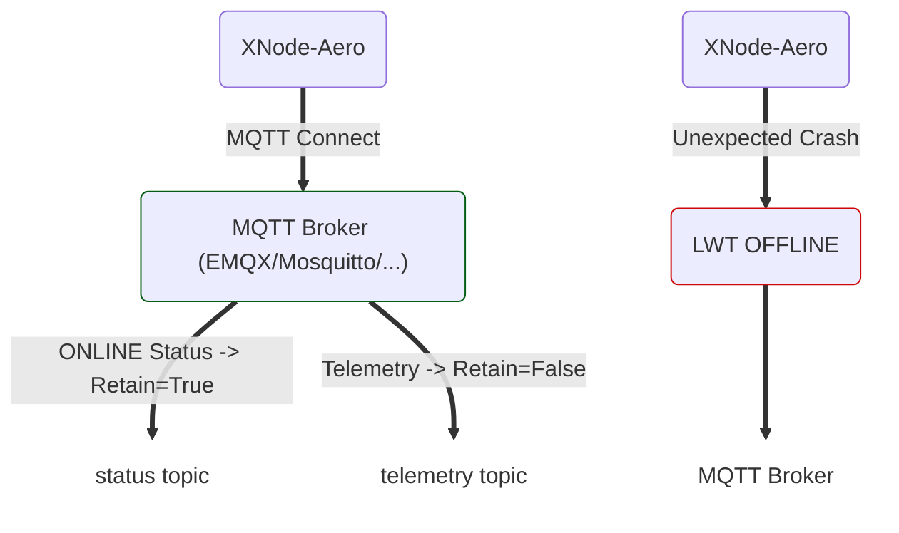

<p align="left">

  <picture>
    <source media="(prefers-color-scheme: dark)" srcset="./assets/prominD_dark.webp">
    <source media="(prefers-color-scheme: light)" srcset="./assets/prominD.webp">
    
  </picture>

</p>

[🇬🇧 English](README.md)


# XNode-Aero MQTT LWT Demo

یک مثال ساده برای نمایش نحوه استفاده از **MQTT 5** با کتابخانه `paho-mqtt` در پایتون.

این مثال روی سه مفهوم مهم MQTT تمرکز داره:

- **Last Will and Testament (LWT)**
- **Retained Messages**
- **Telemetry Messages**

در این سناریو یک دستگاه فرضی با شناسه `xnode-aero-01` به Broker متصل می‌شه، وضعیت خودش رو `online` اعلام می‌کنه و داده‌های تلمتری رو هر ۳ ثانیه ارسال می‌کنه.

اگه دستگاه بدون اجرای `disconnect()` از بین بره، Broker پیام LWT رو منتشر می‌کنه و وضعیت دستگاه رو `offline` اعلام می‌کنه.

---

## سناریو

دستگاه با این Topicها کار می‌کنه:
```text
xmind/xnode/xnode-aero-01/status
xmind/xnode/xnode-aero-01/telemetry
```

### Status

برای وضعیت اتصال دستگاه استفاده می‌شه:
```text
xmind/xnode/<DEVICE_ID>/status
```

این پیام با `retain=True` منتشر می‌شه تا آخرین وضعیت دستگاه روی Broker باقی بمونه.

### Telemetry

برای داده‌های سنسورها استفاده می‌شه:
```text
xmind/xnode/<DEVICE_ID>/telemetry
```

پیام‌های تلمتری با `retain=False` ارسال می‌شن؛ بنابراین Broker آخرین مقدار تلمتری رو به Subscriberهای جدید تحویل نمی‌ده.

---

## جریان اجرای برنامه




---

## پیش‌نیازها

### Python

Python 3.x مورد نیازه.

### نصب Paho MQTT

```bash
python -m pip install paho-mqtt
```

یا:
```bash
pip install paho-mqtt
```

### MQTT Broker

در این مثال Broker روی سیستم محلی اجرا می‌شه:
```text
localhost:1883
```

می‌تونید از Brokerهایی مثل **EMQX** یا **Mosquitto** استفاده کنید.

---

## تنظیمات

این قسمت، تنظیمات اصلی اتصال رو مشخص می‌کنه:
```python
BROKER = "localhost"
PORT = 1883
DEVICE_ID = "xnode-aero-01"
```

اگه Broker روی سیستم دیگه‌ای اجرا می‌شه، مقدار `BROKER` رو عوض کنید.

مثلاً:
```python
BROKER = "192.168.1.100"
```

پورت استاندارد MQTT بدون TLS معمولاً `1883` هست.

---

## احراز هویت

اگه Broker برای اتصال نیاز به Username و Password داشته باشه:
```python
client.username_pw_set("YOUR_MQTT_USER", "YOUR_MQTT_PASS")
```

مقادیر رو با اطلاعات واقعی Broker جایگزین کنید.

اگه Broker شما بدون احراز هویت تنظیم شده، این خط رو می‌تونید حذف کنید.

>❗ برای پروژه واقعی، قرار دادن Username و Password به‌صورت مستقیم داخل Source Code روش مناسبی نیست. بهتره از Environment Variable یا Secret Management استفاده بشه.

---

# Last Will and Testament

یکی از بخش‌های اصلی این مثال، استفاده از **LWT** هست.

قبل از اتصال به Broker، پیام Will تنظیم می‌شه:
```python
lwt_payload = '{"state": "offline", "reason": "unexpected_crash"}'

client.will_set(
    TOPIC_STATUS,
    payload=lwt_payload,
    qos=1,
    retain=True
)
```

**مفهوم:**
> اگه Broker تشخیص بده Client به‌صورت غیرمنتظره اتصالش رو از دست داده، این پیام رو منتشر می‌کنه.

پیام:
```json
{
  "state": "offline",
  "reason": "unexpected_crash"
}
```

با ویژگی‌های زیر تنظیم شده:

|ویژگی|مقدار|دلیل|
|---|---|---|
|Topic|`status`|اعلام وضعیت دستگاه|
|QoS|`1`|افزایش اطمینان از تحویل|
|Retain|`True`|حفظ آخرین وضعیت|
|State|`offline`|اعلام قطع غیرمنتظره|

---

# اتصال به Broker

```python
client.connect(BROKER, PORT, keepalive=10)
client.loop_start()
```

پارامتر `keepalive=10` به MQTT اجازه می‌ده وضعیت ارتباط رو در بازه مناسب بررسی کنه.

تابع `loop_start()` هم Network Loop کتابخانه Paho رو در یک Thread جداگانه اجرا می‌کنه تا ارتباط MQTT و ارسال/دریافت packetها در پس‌زمینه انجام بشه.

---

# اعلام Online شدن

بعد از اتصال موفق، دستگاه پیام زیر رو منتشر می‌کنه:
```json
{
  "state": "online",
  "firmware": "v1.0.4"
}
```

با:
```python
client.publish(
    TOPIC_STATUS,
    payload=online_payload,
    qos=1,
    retain=True
)
```

استفاده از `retain=True` مهمه.

اگه Subscriber بعداً روی Topic وضعیت Subscribe کنه، Broker می‌تونه آخرین وضعیت retained رو براش ارسال کنه.

بنابراین Subscriber لازم نیست حتماً در لحظه Online شدن دستگاه متصل بوده باشه.

---

# ارسال Telemetry

داده‌های تلمتری روی Topic جداگونه منتشر می‌شن:
```python
client.publish(
    TOPIC_TELEMETRY,
    payload=telemetry_payload,
    qos=0,
    retain=False
)
```

نمونه Payload:
```json
{
  "temp": 24.5,
  "hum": 55
}
```

در این مثال:
- `QoS = 0`
- `retain = False`
انتخاب شده.

برای Telemetry که به‌صورت پیوسته ارسال می‌شه، معمولاً نیازی نیست Broker آخرین مقدار رو برای Subscriberهای جدید نگه داره.

---

# شبیه‌سازی Crash

برای آزمایش LWT، اجرای برنامه در صورت زدن `Ctrl+C` عمداً به‌صورت ناگهانی پایان داده می‌شه:
```python
os._exit(1)
```

نکته مهم اینه که قبل از خاتمه برنامه:
```python
client.disconnect()
```
فراخوانی نمی‌شه.

در نتیجه Broker می‌تونه قطع غیرمنتظره Client رو تشخیص بده و پیام LWT رو منتشر کنه:
```json
{
  "state": "offline",
  "reason": "unexpected_crash"
}
```

> ❗ از `os._exit(1)` صرفاً برای شبیه‌سازی Crash در این Demo استفاده شده و روش مناسبی برای خاتمه عادی یک برنامه واقعی نیست.

---

# تست با MQTT Explorer

برای مشاهده رفتار برنامه می‌تونید از **MQTT Explorer** یا یک MQTT Subscriber استفاده کنید.
روی Topic زیر Subscribe کنید:
```text
xmind/xnode/xnode-aero-01/status
```
ابتدا باید پیام:
```json
{
  "state": "online",
  "firmware": "v1.0.4"
}
```
رو دریافت کنید.

بعد از اون برنامه رو با `Ctrl+C` متوقف کنید. (می‌تونید برای توقف ناگهانی اجرای برنامه از هر روش ممکن دیگه هم استفاده کنید. )

اگه Broker قطع غیرمنتظره رو تشخیص بده، پیام LWT دریافت می‌شه:
```json
{
  "state": "offline",
  "reason": "unexpected_crash"
}
```

برای مشاهده Telemetry هم Subscribe کنید:
```text
xmind/xnode/xnode-aero-01/telemetry
```

و پیام‌هایی شبیه موارد زیر دریافت خواهید کرد:
```json
{
  "temp": 24.5,
  "hum": 55
}
```

---

# یادآوری درباره Retain

در این مثال دو رفتار عمداً متفاوت هستن:
```text
/status
    └── Retain = True

/telemetry
    └── Retain = False
```
چرا؟

پارامتر **Status** یک State هست و معمولاً نگه‌داشتن آخرین State منطقیه.

اما **Telemetry** یک Stream از داده‌هاست و معمولاً نمی‌خوایم Broker آخرین نمونه رو به هر Subscriber جدید ارسال کنه.

این یک قانون مطلق نیست؛ انتخاب `retain` باید براساس کاربرد سیستم انجام بشه.

---

# ساختار Topic

ساختار Topic این Demo:
```text
xmind/
└── xnode/
    └── xnode-aero-01/
        ├── status
        └── telemetry
```

این ساختار امکان گسترش سیستم برای چند دستگاه رو فراهم می‌کنه:
```text
xmind/xnode/xnode-aero-01/status
xmind/xnode/xnode-aero-01/telemetry

xmind/xnode/xnode-aero-02/status
xmind/xnode/xnode-aero-02/telemetry
```

---

# مفاهیم MQTT که این Demo نشان می‌دهد

| مفهوم             | استفاده در Demo               |
| ----------------- | ----------------------------- |
| MQTT 5            | پروتکل ارتباطی                |
| Client ID         | شناسایی `xnode-aero-01`       |
| Username/Password | احراز هویت (در اینجا اختیاری) |
| LWT               | اعلام Offline شدن غیرمنتظره   |
| QoS 1             | پیام Status                   |
| QoS 0             | پیام Telemetry                |
| Retain            | حفظ آخرین Status              |
| Non-Retained      | Telemetry                     |
| Keep Alive        | تشخیص وضعیت اتصال             |
| MQTT Topic        | مسیر منطقی پیام‌ها            |

---

## اجرای برنامه

بعد از تنظیم Broker و Credentials:
```bash
python xnode_aero_mqtt.py
```

خروجی نمونه:
```text
[1] Connecting to EMQX...
[2] Published ONLINE status (Retain=True) to xmind/xnode/xnode-aero-01/status
[3] Published Telemetry #1
[3] Published Telemetry #2
[3] Published Telemetry #3
```

با فشردن `Ctrl+C`:
```text
[!] Simulating HARD CRASH (Force Kill)...
```

بعد از اون Broker باید LWT رو منتشر کنه.

---

## هدف آموزشی

این پروژه یک نمونه کوچک برای درک ارتباط بین یک **IoT Device** و **MQTT Broker** هست و به‌خصوص نشون می‌ده که چطوری می‌شه:

1. وضعیت دستگاه رو مدیریت کرد.
2. وضعیت آخرین دستگاه رو با Retain نگه داشت.
3. قطع غیرمنتظره دستگاه رو با LWT تشخیص داد.
4. ارسال Telemetry به‌صورت Non-Retained انجام بشه.
5. برای Status و Telemetry از Topicهای جداگونه استفاده کرد.

---

## License

این پروژه برای اهداف آموزشی ارائه شده است.
**XminD - 2026**

